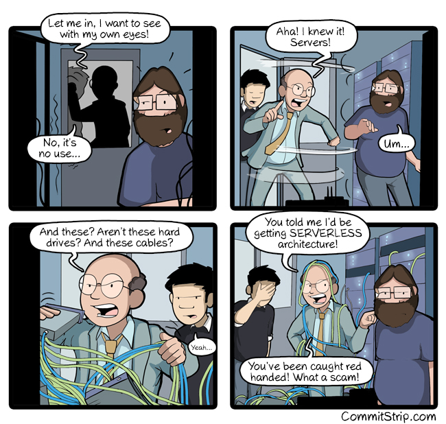

### Fast & Furious
### Java Serverless without JVM

<p>&nbsp;</p>
`Paulo Lopes - @pml0pes` <!-- .element style="font-size: 0.5em" -->

Codemotion meetup 2019

---

## Serverless

<div class="stretch">

</div>

---

> <small>Serverless architectures are application designs that <span class="hl-purple">**incorporate third-party “Backend as a Service” (BaaS) services**</span>, and/or that include <span class="hl-purple">**custom code run in managed, ephemeral containers on a “Functions as a Service” (FaaS) platform**</span>. By using these ideas, and related ones like single-page applications, such architectures <span class="hl-purple">**remove much of the need for a traditional always-on server component**</span>. Serverless architectures may benefit from significantly <span class="hl-purple">**reduced operational cost**</span>, complexity, and engineering lead time, <span class="hl-purple">**at a cost of increased reliance on vendor dependencies and comparatively immature supporting services**</span>.</small>

<small>https://martinfowler.com/articles/serverless.html</small>

---

#### it's all about not worrying about:

* Deploying
* Scaling
* Routing
* Monitoring
* Traffic throttling
* <!-- .element class="fragment" --> **OPS things!**

---

### Function

* A process written in any language.
* Very narrow functional requirements.

---

### FAAS Platforms

* AWS Lambda
* Azure Functions
* Apache OpenWhisk
* OpenFaaS
* TriggerMesh
* Fn Project

---

### Java for Serverless!

<video class="stretch" data-autoplay data-src="media/java-for-serverless.mp4" type="video/mp4" />

---

### Here we go!

```java
@SpringBootApplication
public class Application {
  public static void main(String[] args) {
    SpringApplication.run(Application.class, args);        
    System.out.println("Hello World!");
    System.exit(0);
  }
}
```

---

### TIME

<asciinema-player src="cast/boot-time.cast" rows="24" cols="120"></asciinema-player>

---

### ASM Instructions

<asciinema-player src="cast/boot-instructions.cast" rows="24" cols="120"></asciinema-player>

---

# 32,272,982,449!

---

### 🙌 Spring serverless users?

<video class="stretch" data-autoplay loop data-src="media/seriously.mp4" type="video/mp4" />

---

## 👍 Java Serverless!

<video class="stretch" data-autoplay loop data-src="media/java-serverless.mp4" type="video/mp4" />

---

## 👍 Java Serverless!

* GraalVM
* Eclipse Vert.x (as an example)

---

### GraalVM / Native image

* Aggressive AOT optimizations
* remove unused classes,methods and fields
* static initializers preloaded at compile time
* final ELF binary without need for JVM
* <!-- .element class="fragment" --> Not everything can be compiled (Spring is an example)
* <!-- .element class="fragment" --> There's no JIT
* <!-- .element class="fragment" --> GC is not very powerful 

---

# DEMO

---

<asciinema-player src="cast/openfaas.cast" rows="24" cols="120"></asciinema-player>

---

# 🤔 so what?

<asciinema-player src="cast/stats.cast" rows="24" cols="120"></asciinema-player>

---

## Stats

|      | Spring + JVM |                             Vert.x + GraalVM |
| ---- | -----------: | -------------------------------------------: |
| RAM  |   324.08 MiB |   <span class="hl-purple">**19.8MiB**</span> |
| Time |       2.958s | <span class="hl-purple">**0.000467s**</span> |

<small>** * all results using platform defaults**</small> 

---

## No more waste...

<video class="stretch" data-autoplay loop data-src="media/save.mp4" type="video/mp4" />

---

## Vert.x + GraalVM
### =
### Java Serverless ❤️️! <!-- .element class="fragment" -->

---

## What to learn more?

* https://www.jetdrone.xyz
* http://www.graalvm.org
* https://vertx.io
* https://vertx-starter.jetdrone.xyz/#maven

---

# Thank you!

* <a href="https://twitter.com/pml0pes">https://twitter.com/pml`0`pes</a>
* https://github.com/pmlopes