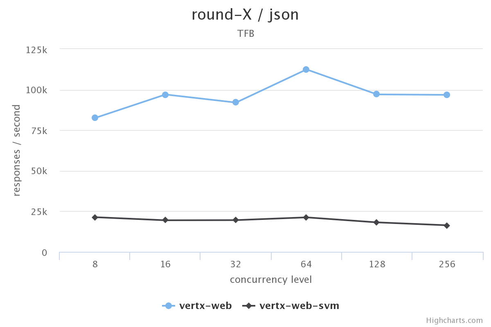
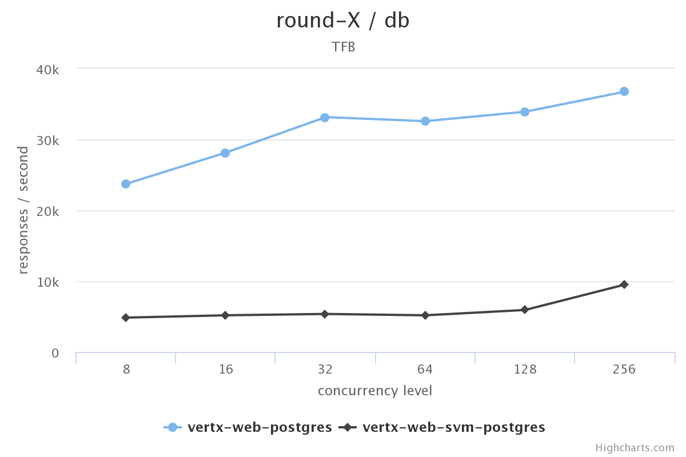

<!-- .slide: data-background-image="media/rht-bg.png" data-background-size="contain" -->

### Building native-images for fun and profit!

<p>&nbsp;</p>
`Paulo Lopes - @pml0pes` <!-- .element style="font-size: 0.5em" -->

Notes:

---
<!-- .slide: data-background-image="media/rht-bg.png" data-background-size="contain" -->

### Hello

```java
public class Hello {
  public static void main(String[] args) {
    System.out.println("Hi, I'm Paulo!");
  }
}
```
<pre><code data-trim data-noescape><small>
$ <span class="fragment">javac Hello.java
$ </span><span class="fragment">native-image Hello</span>
<span class="fragment">[hello:13575]    classlist:   1,317.64 ms
[hello:13575]        (cap):   1,159.12 ms
[hello:13575]        setup:   2,575.85 ms
[hello:13575]   (typeflow):   4,667.41 ms
[hello:13575]    (objects):   2,459.68 ms
[hello:13575]   (features):     107.04 ms
[hello:13575]     analysis:   7,370.71 ms
[hello:13575]     universe:     419.05 ms
[hello:13575]      (parse):     837.78 ms
[hello:13575]     (inline):   1,295.41 ms
[hello:13575]    (compile):   6,893.52 ms
[hello:13575]      compile:   9,470.76 ms
[hello:13575]        image:   1,003.65 ms
[hello:13575]        write:     228.39 ms
[hello:13575]      [total]:  22,461.86 ms</span>
</small></code></pre>

---
<!-- .slide: data-background-image="media/rht-bg.png" data-background-size="contain" -->

### Time

<div style="display: inline-block; width: 48%; float: left;">
<pre style="width: 100%"><code data-trim class="sh">
$ time java Hello
Hi, I'm Paulo!

real    0m0,085s
user    0m0,063s
sys     0m0,026s
</code></pre></div>

<div style="display: inline-block; width: 48%;" class="fragment">
<pre style="width: 100%"><code data-trim class="java">
$ time ./hello
Hi, I'm Paulo!

real    0m0,004s
user    0m0,002s
sys     0m0,003s
</code></pre></div>

## 20x speedup!!! <!-- .element class="fragment" -->

---
<!-- .slide: data-background-image="media/rht-bg.png" data-background-size="contain" -->

### native images are super fast!

 <!-- .element class="stretch" -->

Notes:
  Given the previous result, many will assume that native images are super fast. Before going to that direction, let's see what the team behind the project say are the real use cases.

---
<!-- .slide: data-background-image="media/rht-bg.png" data-background-size="contain" -->

### Benchmark (TechEmpower)

<div style="display: inline-block; width: 48%; float: left;">
</img>
</div>

<div style="display: inline-block; width: 48%;">
</img>
</div>

https://www.techempower.com/benchmarks/

---
<!-- .slide: data-background-image="media/rht-bg.png" data-background-size="contain" -->

# 🤔

---
<!-- .slide: data-background-image="media/rht-bg.png" data-background-size="contain" -->

### native images are fast enough!

<div class="stretch"></div>

Notes:

---
<!-- .slide: data-background-image="media/rht-bg.png" data-background-size="contain" -->

## Use cases
### native images <small>VS</small> regular JVM

---
<!-- .slide: data-background-image="media/rht-bg.png" data-background-size="contain" -->

### Native Images

* Startup time matters
  * **Short-running** command line applications
  * **Serverless** cloud functions
* Memory footprint matters
  * **Small** to medium-sized heaps <small>(100Mb ~ 1Gb)</small>
* All java code is known ahead of time
  * **Single-application** cloud server

---
<!-- .slide: data-background-image="media/rht-bg.png" data-background-size="contain" -->

### Regular Java VM

* Heaps size is large
  * Big Data analytics
  * Multiple GByte ~ TByte heap size
* Classes are only known at run time
  * "traditional" java application server
  * frameworks full of <s>magic</s> annotations

---
<!-- .slide: data-background-image="media/rht-bg.png" data-background-size="contain" -->

## Obvious use case

## Serverless <!-- .element class="fragment" -->

Notes:
  faas template pull https://github.com/pmlopes/openfaas-svm-vertx
  faas new --lang vertx-svm hello-jfall
  write code
  faas-cli build -f hello-jfall.yml
  faas-cli deploy -f hello-jfall.yml
  docker stats

---
<!-- .slide: data-background-image="media/rht-bg.png" data-background-size="contain" -->

### How does it work?

* Static analysis needs to see all the bytecode
* Otherwise:
  * aggressive AOT optimizations are not possible
  * unused classes/methods and fields cannot be removed
  * class loader/bytecode interpreter is necessary at runtime

Notes:
  Closed World Assumption

---
<!-- .slide: data-background-image="media/rht-bg.png" data-background-size="contain" -->

## SubstrateVM `!=` JVM

---
<!-- .slide: data-background-image="media/rht-bg.png" data-background-size="contain" -->

| What Works/ What doesn't                  | Status    |
| ----------------------------------------- | ----------|
| Dynamic Class (Un)Loading                 | ✘ |
| Reflection                                | Mostly |
| Dynamic Proxy                             | Mostly |
| InvokeDynamic/Method Handles              | ✘ |
| Threads                                   | ✔ |
| Synchronized, wait, and notify            | ✔ |
| Security Manager                          | ✘ |
| References                                | Mostly |

Notes:

---
<!-- .slide: data-background-image="media/rht-bg.png" data-background-size="contain" -->

| What Works/ What doesn't                  | Status    |
| ----------------------------------------- | ----------|
| Finalizers                                | ✘ |
| Java Native Interface (JNI)               | Mostly |
| Unsafe Memory Access                      | Mostly |
| Static Initializers                       | Partially |
| Lambda Expressions                        | ✔ |
| Identity Hash Code                        | ✔ |
| JVMTI, JMX, other native VM interfaces    | ✘ |

Notes:
  This means that most likely your spring code will not work but many microframeworks, Vert.x for example will.

---
<!-- .slide: data-background-image="media/rht-bg.png" data-background-size="contain" -->

## The Bad News...

* Not every application can be compiled to SVM
* **There is no JIT** (It's AOT remember?)
* **GC is simple**

---
<!-- .slide: data-background-image="media/rht-bg.png" data-background-size="contain" -->

## The Good news...

* Vert.x works <small class="fragment">(mileage varies greatly depending on your stack)</small>
* <!-- .element class="fragment" --> Out of the box <small>web, redis, postgres, gRPC, sockjs, websockets, oauth2, https, etc...</small>
* <!-- .element class="fragment" --> Low resources
* <!-- .element class="fragment" --> Fast startup

---
<!-- .slide: data-background-image="media/rht-bg.png" data-background-size="contain" -->

## Vert.x
#### (Demo)

http://bit.ly/jfall-2018

Notes:
  Let's build a secure realtime bitcoin visualization app.

---
<!-- .slide: data-background-image="media/rht-bg.png" data-background-size="contain" -->

#### Don't be afraid of the main
```java
public class Main {

  public static void main(String[] args) {
    final Vertx vertx = Vertx.vertx();
    final EventBus eventbus = vertx.eventBus();

    final PgPool postgres = PgClient.pool(...);

    BlockChainClient.create(vertx).connect(self -> {
        self.subscribeUnconfirmed(json -> {
          ...
```

---
<!-- .slide: data-background-image="media/rht-bg.png" data-background-size="contain" -->

#### No magic, all must be known
```java
postgres.preparedQuery(
  "INSERT INTO UTX (data) VALUES ($1)",
  Tuple.of(Json.create(json)),
  result -> {
    ...
    eventbus.publish("data.updates", result.value());
    ...

```

---
<!-- .slide: data-background-image="media/rht-bg.png" data-background-size="contain" -->

#### Explicit APIs always work!

```java
OAuth2Auth authProvider = GithubAuth.create(...);

final Router app = Router.router(vertx);

app.route()
  .handler(CookieHandler.create())
  .handler(SessionHandler.create(...))
  .handler(UserSessionHandler.create(authProvider));
// secure everything under this line
app.route()
  .handler(OAuth2AuthHandler.create(authProvider))
  .handler(StaticHandler.create());

```

---
<!-- .slide: data-background-image="media/rht-bg.png" data-background-size="contain" -->

#### So does HTTPS

```java
HttpServerOptions httpOptions = new HttpServerOptions()
  .setSsl(true)
  .setKeyStoreOptions(new JksOptions()
    .setPath("certificates.keystore")
    .setPassword("localhost"));

// start the server
vertx
  .createHttpServer(httpOptions)
  .requestHandler(app)
  .listen(8443);
```

---
<!-- .slide: data-background-image="media/rht-bg.png" data-background-size="contain" -->

# Build it!

---
<!-- .slide: data-background-image="media/rht-bg.png" data-background-size="contain" -->

## 2<small>m</small>53,921<small>s</small> later...


```
Successfully built 0eac1f36c827
Successfully tagged bitcoinviewer_vertx-bitcoin:latest
```

---
<!-- .slide: data-background-image="media/rht-bg.png" data-background-size="contain" -->

# Run it!

---
<!-- .slide: data-background-image="media/rht-bg.png" data-background-size="contain" -->

## You can already use vert.x and native images for...

<span class="fragment">http(s) servers</span><span class="fragment">, http(s) clients</span><span class="fragment">, postgres client</span><span class="fragment">, websocket client</span><span class="fragment">, web router</span><span class="fragment">, cookies</span><span class="fragment">, sessions</span><span class="fragment">, oauth2 security</span><span class="fragment">, websocket server</span><span class="fragment">, realtime eventbus</span><span class="fragment">, redis</span><span class="fragment">, gRPC</span><span class="fragment">, ssl</span><span class="fragment">, etc...</span><span class="fragment">, etc...</span>
<span class="fragment">, etc...</span>

---
<!-- .slide: data-background-image="media/rht-bg.png" data-background-size="contain" -->

### it's gonna be a wild ride!


---
<!-- .slide: data-background-image="media/rht-bg.png" data-background-size="contain" -->

## Tip #1
#### https not working?

```
--enable-all-security-services
--enable-url-protocols=https
```

---
<!-- .slide: data-background-image="media/rht-bg.png" data-background-size="contain" -->

## Tip #2
#### Initialization errors?

```
--delay-class-initialization-to-runtime=...
```

---
<!-- .slide: data-background-image="media/rht-bg.png" data-background-size="contain" -->

## Tip #3
#### Resources not available?

```
-H:IncludeResources=webroot/.*
```

---
<!-- .slide: data-background-image="media/rht-bg.png" data-background-size="contain" -->

## Tip #4
#### Dead code removal to agressive?

```
-H:ReflectionConfigurationFiles=reflection.json
```

---
<!-- .slide: data-background-image="media/rht-bg.png" data-background-size="contain" -->

## Tip #5
#### Missing classes?

```
-H:+ReportUnsupportedElementsAtRuntime
```

---
<!-- .slide: data-background-image="media/rht-bg.png" data-background-size="contain" -->

## Tip #6
#### Still blocked?

https://github.com/oracle/graal/issues

---
<!-- .slide: data-background-image="media/rht-bg.png" data-background-size="contain" -->

# Questions?

---
<!-- .slide: data-background-image="media/rht-bg.png" data-background-size="contain" style="text-align: left;" -->

# Thank you!

* https://www.graalvm.org
* https://vertx.io
* https://www.jetdrone.xyz
* https://twitter.com/pml0pes
