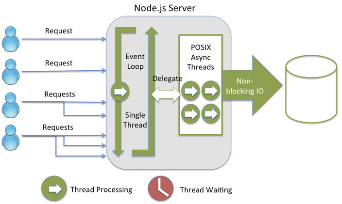
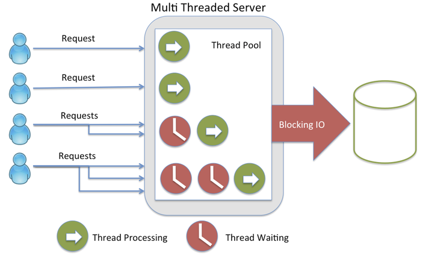
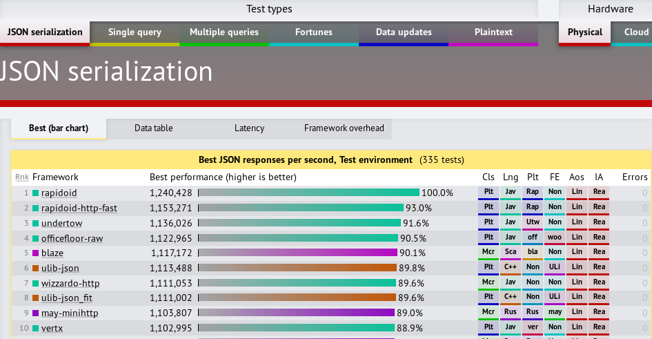
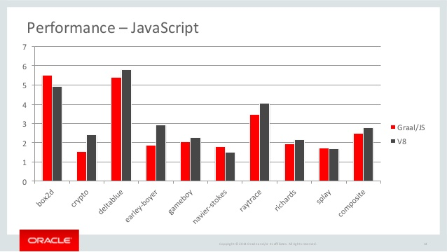
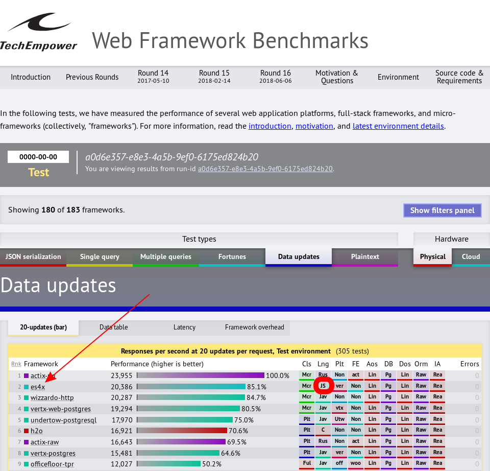
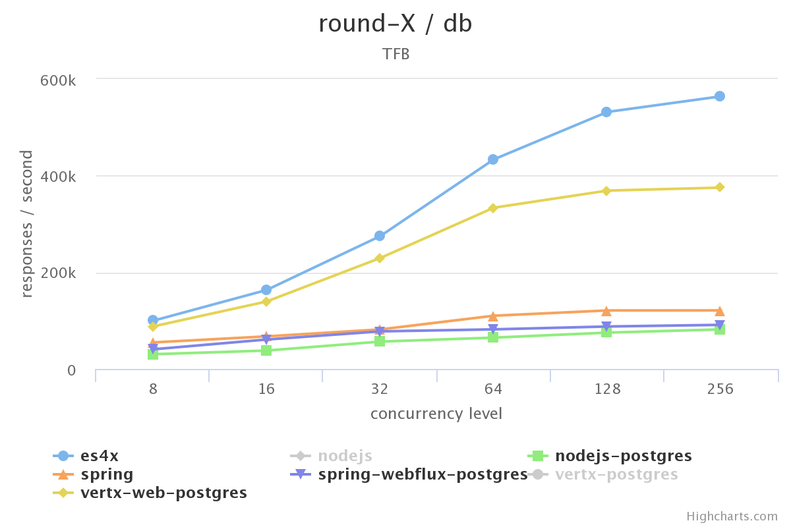
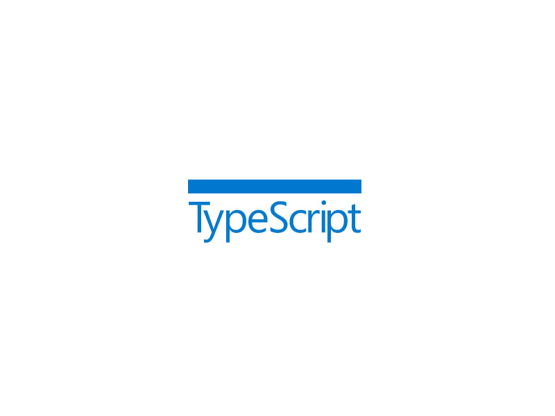

### Yes JavaScript is **faster**
### than Java<small>*</small>!
###### <small><small>*</small> when you use GraalVM</small>

<p>&nbsp;</p>
`Paulo Lopes - @pml0pes` <!-- .element style="font-size: 0.5em" -->

Notes:

---

### *I'm a ... Developer!*

* Polyglot <small class="fragment">Java (since 1.1.4)</small> <small class="fragment">JavaScript (since Netscape 4.0)</small>
* Game <small class="fragment">AAA (7th Gen)</small> <small class="fragment">Social Games</small>
* Open Source <small class="fragment">Eclipse Vert.x</small>
* <!-- .element class="fragment" --> RedHat Principal Software Engineer

Notes:

---

### JavaScript

#### Properties <!-- .element: style="text-align: left;" class="fragment" -->
<div style="text-align: left">
  <small class="fragment">Infinity</small>
  <small class="fragment">NaN</small>
  <small class="fragment">undefined</small>
  <small class="fragment">null</small>
</div>

#### Functions <!-- .element: style="text-align: left;" class="fragment" -->
<div style="text-align: left">
  <small class="fragment">eval()</small>
  <small class="fragment">isFinite()</small>
  <small class="fragment">isNan()</small>
  <small class="fragment">parseFloat()</small>
  <small class="fragment">parseInt()</small>
  <small class="fragment">decodeURI()</small>
  <small class="fragment">decodeURIComponent()</small>
  <small class="fragment">encodeURI()</small>
  <small class="fragment">encodeURIComponent()</small>
</div>

#### Objects <!-- .element: style="text-align: left;" class="fragment" -->
<div style="text-align: left">
  <small class="fragment">Object</small>
  <small class="fragment">Function</small>
  <small class="fragment">Boolean</small>
  <small class="fragment">Error</small>
  <small class="fragment">Number</small>
  <small class="fragment">Math</small>
  <small class="fragment">Date</small>
  <small class="fragment">String</small>
  <small class="fragment">RegExp</small>
  <small class="fragment">Array</small>
</div>

Notes:
  So what is so interesting with `JavaScript`? let's do a crash course on the language. The core runtime defines a set of Properties, Functions and Objects. Once a developers knows these, all the building blocks are available to start coding.

  So If I have to enumerate almost all the API, it would fit in this slide, let see...

---

<!-- .slide: data-background-video="media/iknowkungfu.mp4" data-background-size="contain" -->

Notes:
  It's so simple that you get that feeling right...

---

## I Know JavaScript!

Notes:

---

### JavaScript (and the JVM)

* (Dec 2006) Rhino 1.6r2 is bundled with Java 6
* <!-- .element class="fragment" --> (May 2009) Node.js is presented at JSConf
* <!-- .element class="fragment" --> (Mar 2013) Node.js 0.10.x release
* <!-- .element class="fragment" --> (Mar 2014) Nashorn is bundled with Java 8

Notes:
  Lets focus now on JavaScript and the JVM

  Rhino started at Netscape in 1997, when they were planning to produce a version of the Netscape Navigator written fully in Java. Originally Rhino compiled all JavaScript code to byte code.  But this had 2 faults: Compile time was long and very resource intensive, second it leaked memory as class loaders didn't release the compilation resources.

  Nodejs was introduced in 2009 but not until the 0.10.x series it got popular. It introduced the single thread event driven programming to server developers was built on top of V8, the JavaScript engine running on Google Chrome.

  In March 2014, With the release of Java8 Nashorn was introduced, it improved the performance of JavaScript on the JVM in several orders of magnitude than Rhino and bumped the JavaScript language level from JavaScript 1.7 to EcmaScript 5.1.

---

### Why care about JavaScript?

* *Everyone* knows the language
* <!-- .element class="fragment" --> Productive <small>write, (debug), run!</small>
* <!-- .element class="fragment" --> Millions of libraries on NPM <small>Yes I know leftpad!</small>
* <!-- .element class="fragment" --> Fullstack

Notes:
  JavaScript is simple, at its core there's just a full hand of types and functions, so the learning curve is very low. Most of the time there's almost no requirements to start coding, from the browser, open the devtools and you are already writing code. The community has provided millions of libraries, and for many projects this allowed, developers to cross borders in their stacks. Frontend developers could write backend code, and backend developers could write frontend applications.

---

### nodejs is fast! <span class="fragment">(not really!)</span>

<div style="display: inline-block; width: 50%; float: left;">

</div>

<div style="display: inline-block; width: 50%;" class="fragment">

</div>

<small>https://strongloop.com/strongblog/node-js-is-faster-than-java/</small>

Notes:
  One of the biggest urban myths out there is that nodejs is faster than java, however all articles state that java application are by nature thread based and therefore susceptible to locking and waste of resources.

---


<small>https://www.techempower.com/benchmarks/</small>

Notes:
  The reality shows that JVM based frameworks rule independent benchmarks.

---

### GraalJS



<small>https://www.slideshare.net/ThomasWuerthinger/2015-cgo-graal</small>

Notes:
  GraalJS is the new contender. The project goals are:

  * Execute JavaScript code with best performance
  * Full compatibility with the latest ECMAScript
  * Fast interoperability with JVM/GraalVM langs

---

### The need for speed

* Fast <small class="fragment">nashorn</small>
* Faster <small class="fragment">nodejs</small>
* Fastest  <small class="fragment">graaljs</small>

Notes:
  Even though performance increased from Rhino to Nashorn (and by the way, nashorn is Rhinoceros in German), the project failed at keeping up to date with the fast pace of evolution of the JavaScript world.

  On the other hand, nodejs is sitting on the shoulders of giants. It's build on top of V8 (Google Chrome, JavaScript engine) which is constantly working on getting the best performance possible and spec compliance possible.

  And recently, Oracle open sources graaljs. GraalJS runs on GraalVM and show some promising results.

---

# Performance

* Get closer to the Hardware
* Go Hybrid

---

### Close to the hardware

```
.text
  .global _start
_start:
  movl    $len,%edx
  movl    $msg,%ecx
  movl    $1,%ebx
  movl    $4,%eax
  int     $0x80
  movl    $0,%ebx
  movl    $1,%eax
  int     $0x80
...
```

Notes:
  Sometimes it is fast but not really maintainable...

---

### Hybrid model

* pick a good jvm framework <small class="fragment">Vert.x</small>
* make it polyglot <small class="fragment">JavaScript + Tooling</small>
* profit <small class="fragment">ES4X</small>

Notes:
  The hybrid approach is, pick a good candidate from the current benchmark that can be made polyglot and profit.

---

# ES4X

* latest JavaScript support <small>*With GraalVM*</small>
* `package.json` / "`NPM`" development style
* great tooling IntelliSense, Debugging <small>*With TypeScript*</small>
* insane performance!

Notes:
  EcmaScript for Vert.x or ES4X is a runtime that supports the latest JavaScript language spec and features, uses a NPM development approach so tooling is familiar to JavaScript developers and has support for code completion, debugging and great performance.

---

### Why Vert.x?

* Toolkit
* <!-- .element class="fragment" --> Unopiniated
* <!-- .element class="fragment" --> Polyglot
* <!-- .element class="fragment" --> Reactive
* <!-- .element class="fragment" --> Distributed

Notes:
  * It's a toolkit, not a full blown framework
  * It doesn't impose a rigid workflow or dependencies
  * It is designed with polyglot in mind so APIs are kept simple and explicit rather than implicit
  * It is reactive and a signee of the reactive manifesto
  * which makes it trivial to build distributed scalable applications

---

## Demo 0

Notes:
  Quick Vert.x intro

---

### How fast?

<!-- .element class="stretch" --> 

Notes:
  The fastest JS you can find.

---

<!-- .slide: data-background-video="media/notfair.mp4" data-background-size="contain" -->

---

### Faster than Java

<!-- .element class="stretch" --> 

Notes:
  In fact the combination of Vert.x and Graal gives you one of the best performances when compared to:

  * Vert.x Web on plain OpenJDK8

  Or the references

  * nodejs (same language)
  * spring (most popular choice on the JVM)

---

### Why TypeScript?



Notes:
  TypeScript is a key player in the project, but it's role is rather hidden. TypeScript Definition files are generated for all the vert.x API and this will allow us to benefit from proper code completion, intellisense, hinting at code time, but will stay out of our way at runtime, so the performance penalty is 0%. Let's consider an example to make thinks easier to understand:

---

## The Basics

* bootstrap project
* create simple app <small>the code from the previous slide</small>
  * code completion
  * debugging
* (bonus) async await

Notes:
  Lets make a small demo to ilustrate the basics.

---

# DEMO I

---

## Lets Integrate!

* server side rendering with `reactjs`
* integrate with drools `¯\_(ツ)_/¯`

Notes:
  The power of using ES4X and Graal is not about performance, the true power is about integration, Vert.x and Graal allow you to use the best of both worlds, integrate with your favorite frontend framework and your business logic written for the JVM. Here's an example.

---

# DEMO II
---

# Vert.x    <!-- .element class="fragment" -->
# +         <!-- .element class="fragment" -->
# GraalVM   <!-- .element class="fragment" -->
# = ❤️      <!-- .element class="fragment" -->

---

<!-- .slide: style="text-align: left;" -->
# Thank you!

* https://reactiverse.io/es4x
* https://www.graalvm.org
* https://vertx.io
* https://www.jetdrone.xyz
* https://twitter.com/pml0pes
