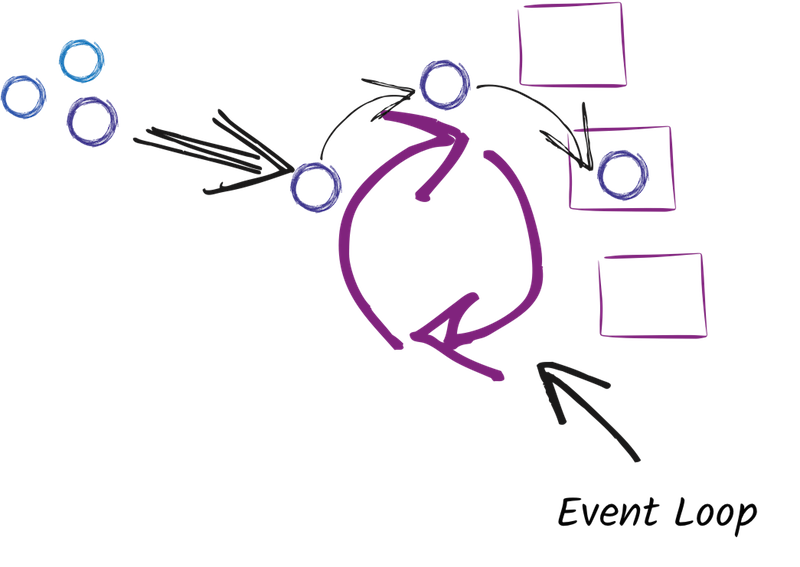

<!-- .slide: data-background="media/withthebest.png" data-background-size="contain" -->

Notes:
  Hello everyone and welcome to "going fullstack reactive". My name is Paulo Lopes and
  I'm a Principal Software Engineer at RedHat and a core developer of the Eclipse Vert.x
  project.

---

## *What is a Reactive?*

Notes:
  Let start with the question: "What is a Reactive"?

---

## Reactive is...

* <!-- .element class="fragment" --> Message Driven
* <!-- .element class="fragment" --> Responsive

Notes:
  Google is your friend so you will find that most articles state that:

  * If you adopt a message driven development architecture,
  * And adopt a programming style around data flows, _or events if you like_

  You're reactive... _(pause)_

  And this isn't something new! Node.js is doing it for many years and we see that it is catching up on the Java side too.

---

## Reactive <span class="fragment hl-purple">Programming</span>

* Message Driven
* Responsive

Notes:
  In computer science there are only 2 hard things:

  * cache invalidation
  * naming things

  What we just describes is in fact, reactive programming. It is a programming paradigm oriented around data flows and the propagation of change. This is the programming model of `Node.js` and `Eclipse Vert.x` for example.

---

## Reactor Pattern

<!-- .element class="stretch" --> 

Notes:
  The concept is simple. There is a single process/thread running an infinite loop. If picks events (from the left), for example, HTTP requests, SQL results and passes them to the correct handler (or callback if you prefer). The handler can complete the execution or produce new events to be consumed on the following iteration.

---

## Multi Reactor Pattern

<!-- .element class="stretch" --> 

Notes:
  Vert.x improves the event loop pattern by implementing the **multi event loop pattern**. Which means that there will be an event loop per CPU core on your system, maximizing the usage of the computing resources available.

---

## Reactive <span class="fragment hl-purple">System</span>

* Message Driven
* Responsive
* <!-- .element class="fragment hl-purple" -->Resilient
* <!-- .element class="fragment hl-purple" -->Elastic

Notes:
  Reactive systems as described on the reactive manifesto have 2 more traits:

  * It states that the system is resilient against failure
  * and elastic so it can scale with the load.

  Examples of projects that implements all these traits are `Akka` and `Vert.x`.

---

<!-- .element class="stretch" --> 

Notes:
  Reactive systems use a Message Driven arquitecture in order to implement those traits. Vert.x for example relies on the event bus to connect, nodes on the same host, across hosts or even non JVM nodes such as Node.js or even native applications.

---

## *Why Reactive?*

<pre><code data-trim class="java" data-noescape>
@RequestMapping(value = "/work", method = RequestMethod.GET)
public @ResponseBody String work(HttpServletResponse resp) {
  resp.setContentType("text/plain");
  resp.setCharacterEncoding("UTF-8");
  <mark>return doSomeWork();</mark>
}
</code></pre>

Notes:
  It makes sense to ask, why reactive? as it sure feels like over engineering.

  Look at this code, imagine that your server runs with a thread pool of 100 elements. Now imagine that the method `doSomeWork()` does consume several seconds to complete. If you are running a popular site, you'll get more than 100 concurrent users, which means, all your user will see is:

---

<!-- .element class="stretch" --> 

Notes:
  And we all know that every person hates to wait...

---

## Page load time research say:


<small>*source: https://www.truconversion.com/blog/traffic/decrease-page-load-time/*</small>

Notes:
  Clearly, having a website that loads instantaneously is sort of difficult to build. So, does this mean that you are doomed?

  No. There is an allowance.

  At least 83% of people expect a page to load within three seconds or less. After this, the one second delay effects as in this infographic come into play.

  If you don’t stick to the 3-second window, then you risk an abandonment rate of over 40%.

---

## *Where to be reactive?*

* on the frontend? <span class="fragment hl-purple">**YES**</span>
* on the backend? <span class="fragment hl-purple">**YES**</span>
* both? <span class="fragment hl-purple">**YES**</span>

Notes:
  How should we solve this problem? On the frontend web application? on your backend server? Both? As you can imagine the anwser to these questions is yes, yes and yes! So let me show you one possible way, and lets start top down, front to back.

---

## Frontend <small>react.js</small>

* Simplicity
* Component Based Approach
* Great Performance and Virtual DOM
* SSR support for SEO
* Testability/Developers tools
* <!-- .element class="hl-purple" -->Bonus: Mobile apps with react native

Notes:
  Why react.js? react is a JavaScript library. It’s not a framework. It’s not a complete solution and we’ll often need to use more libraries with React to form any solution. React does not assume anything about the other parts in any full solution. It focuses on just one thing, and on doing that thing very well.

  The thing that React does really well is building User Interfaces. A User Interface is anything we put in front of users to have them interact with a machine.

---

## Backend <small>vert.x</small>

* Toolkit
* Unopinionated
* Reactive
* Polyglot
* Distributed

Notes:
  On the backend I would choose a Eclipse Vert.x. Vert.x is a toolkit, just like react.js it is not a framework, it puts developers on the front seat and does not force any opinion/pattern to solve the developer problem. It is reactive as previously illustrated, it is polyglot, it runs on the JVM but does not force you to use Java, you're not limited by what you know and can choose the best language for your problem (Java, JavaScript, Kotlin, Scala...) and above all it is distributed.

---

## To put in perspective

| (out of the box) | Spring5 | node.js | vert.x | Akka |
| ---------------- |:-------:|:-------:|:------:|:----:|
| Responsive       | ✔       | ✔      | ✔     | ✔    |
| Message Driven   |         |         | ✔     | ✔    |
| Resilient        |         |         | ✔     | ✔    |
| Elastic          |         |         | ✔     | ✔    |

Notes:
  To put things in perspective about my choices, let me illustrate what you get out of the box in relation to the reactive manifesto requirements. As you can see most modern frameworks will adopt a reactive programming style, but not all are reactive systems.

---

## *3 seconds<span class="fragment hl-purple">.</span><span class="fragment">.</span><span class="fragment hl-purple">.</span>*

Notes:
  We've drifted a bit, but lets get back, remember you've 3 seconds... or else you will start loosing your users. So let me show how to implement the backend of an hypothetical application.

---

<!-- .element class="stretch" --> 

Notes:
  This application will have the following flow: Your browser will make a request, the backend application will request the reactive system to locate a service capable of rendering a specific path in the URL. Once the markup is generated, the application will pass the response to handlebars to enrich it and have a full blown HTML page that will be returned to the Browser.

---

<div style="display: inline-block; width: 50%; float: left;">

<div><small>
<pre style="width: 100%"><code data-trim class="java">
// Initial setup                                    //
var react = ReactSSR.createProxy(vertx);
var handlebars = HandlebarsTemplateEngine.create();
// Dummy data...
var posts = new JsonArray(
  vertx.fileSystem()
    .readFileBlocking("posts.json"));
// Route web requests to handlers...
var app = Router.router(vertx);
</code></pre></small></div>

<div class="fragment"><small>
<pre style="width: 100%"><code data-trim class="java">
// Rest API                                         //
app.get("/api/post").handler(ctx -> {
  ctx.response()
    .putHeader("content-type", "application/json")
    .end(posts.encode());
});
// Get a single post
app.get("/api/post/:id").handler(ctx -> {
  int id = Integer.parseInt(ctx.pathParam("id"));

  for (Object p : posts) {
    if (((JsonObject) p).getInteger("id") == id) {
      ctx.response()
        .putHeader("Content-Type", "application/json")
        .end(((JsonObject) p).encode());
      return;
    }
  }

  ctx.fail(404);
});
</code></pre></small></div>
</div>

<div style="display: inline-block; width: 50%;">
<div class="fragment"><small>
<pre style="width: 100%"><code data-trim class="javascript">
// Mix React.JS with Vert.x                          //
app.route().handler(ctx -> {
  react.render(ctx.request().uri(), res -> {
    if (res.failed()) {
      ctx.fail(res.cause());
    } else {
      String markup = res.result();
      if (markup == null) {
        ctx.next();
      } else {
        handlebars.render(ctx.put("markup", markup),
          "hbs/index.hbs", res1 -> {
            if (res1.failed()) {
              ctx.fail(res1.cause());
            } else {
              ctx.response()
                .putHeader("Content-Type", "text/html")
                .end(res1.result());
            }
        });
      }
    }
  });
});
</code></pre></small></div>
<div class="fragment"><small>
<pre style="width: 100%"><code data-trim class="javascript">
// Serve resources and start                         //
app.route().handler(StaticHandler.create());
// Start server
vertx.createHttpServer()
  .requestHandler(app::accept).listen(8080);
</code></pre></small></div>
</div>

<small>source: https://github.com/pmlopes/presentations/tree/java-withthebest</small>

---

```hbs
<!DOCTYPE html>
<html lang="en">
<head>
  <link rel="stylesheet" href="wing.min.css" />
  <meta charset="UTF-8">
  <title>Fullstack Reactive</title>
</head>
<body>
<div id="app">{{{ markup }}}</div>
<script src="main.js"></script>
</body>
</html>
```

<small>source: https://github.com/pmlopes/presentations/tree/java-withthebest</small>

---

### Deployment

<pre><code data-trim data-noescape class="sh">
$ <span class="fragment"># build react.js part
$ npm run build
...
$ </span><span class="fragment"># build vert.x part
mvn clean package
...
$ </span><span class="fragment"># start it
docker-compose start
Starting web   ... done
Starting react ... done
$ </span>
</code></pre>

Notes:
  This is a simple application so in order to build we take a few steps. 1st we build the reactjs part using the standard javascript tools. 2nd we build the server side using maven, finally we start it inside a container using docker compose.

---

### Deployment (Reactive <span class="hl-purple">System</span>)

<!-- .element class="stretch" --> 

<pre><code data-trim data-noescape class="sh">
$ <span class="fragment"># scale up
$ docker-compose scale react=2
...
$ </span><span class="fragment"># scale down
docker-compose scale react=1
...
$ </span>
</code></pre>

Notes:
  As you could have seen in the previous slide the application started 2 containers, one for the web and a second for the react server side rendering. This is where reactive systems shine. You can scale up *click* or down *click* making your system elastic and more resilient to failure.

---

### Deployment (Reactive <span class="hl-purple">System</span>)

<!-- .element class="stretch" --> 

<pre><code data-trim data-noescape class="sh">
$ <span class="fragment"># swap implementations
$ docker-compose scale react-nodejs=1
...
$ </span>
</code></pre>

Notes:
  Or even hypothetically replace implementations without code refactoring or down time.

---

<!-- .slide: data-background-video="media/serversiderendering-slow.mp4" data-background-size="contain" -->

---

## A reactive system:

* <!-- .element: class="fragment grow" --> Makes your users happy
* <!-- .element: class="fragment grow" --> Has high performance
* <!-- .element: class="fragment grow" --> Scales without code change
* <!-- .element: class="fragment grow" --> Is resilient to failure

Notes:
  Lets summarize what we've covered so far: A reactive system makes your users happy, It brings hight performance by using your computing resources effectively (probably it could even reduce your cloud bill). It scales up and down without code changes so you can adapt to load as needed. And because of this elasticity it is also resilient to failure as each service can be respawn at any moment and take over the load of a bad behaved one.

---

<!-- .slide: style="text-align: left;" -->
# Thank you!

* https://vertx.io
* https://www.jetdrone.xyz
* https://twitter.com/pml0pes
* https://www.reactivemanifesto.org
