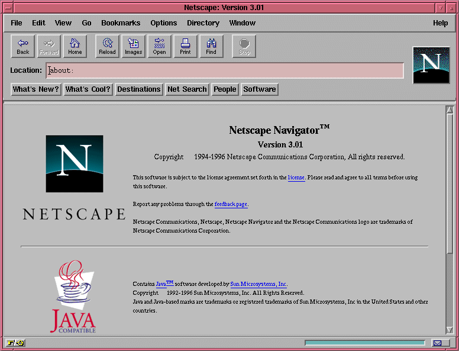
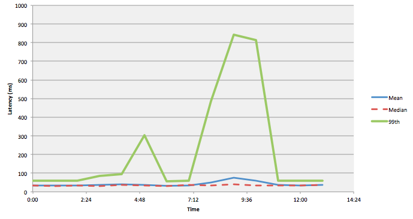
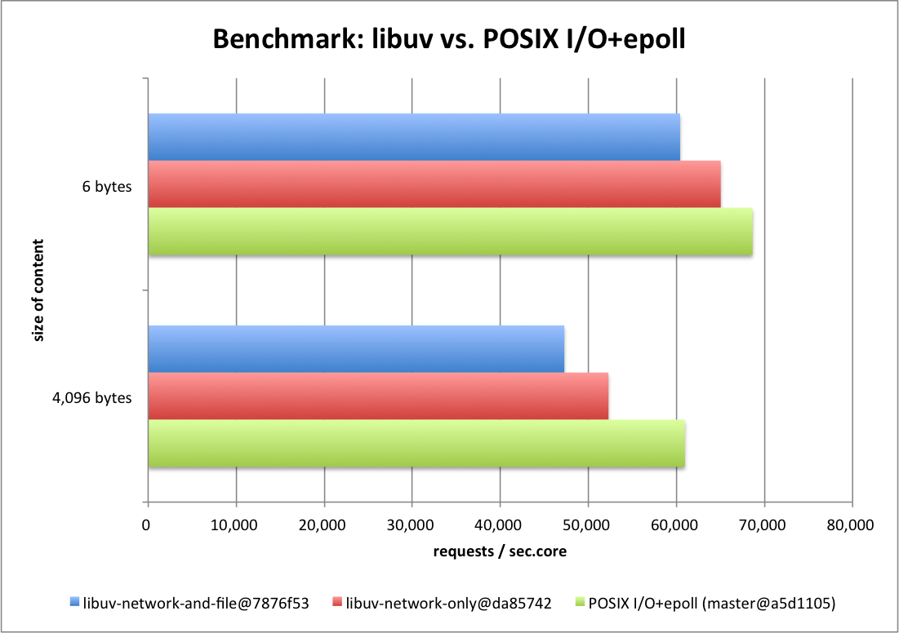
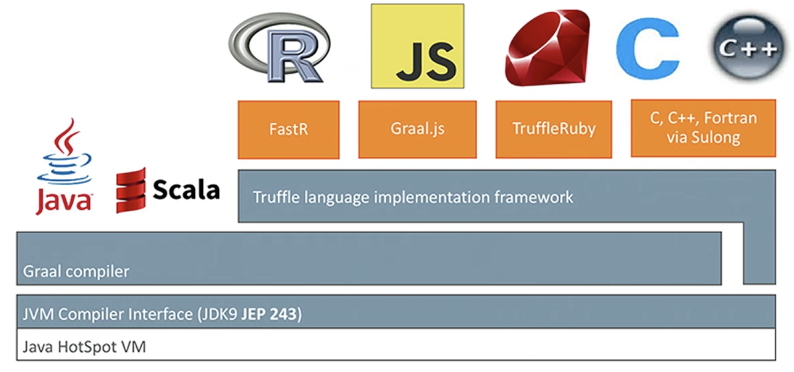
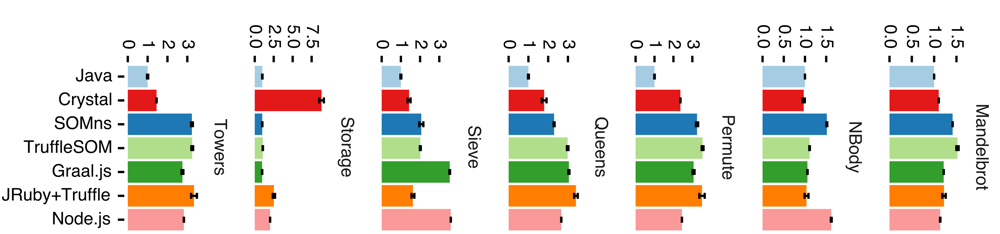
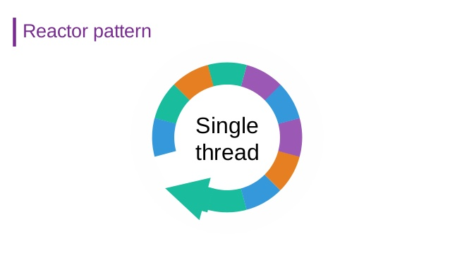
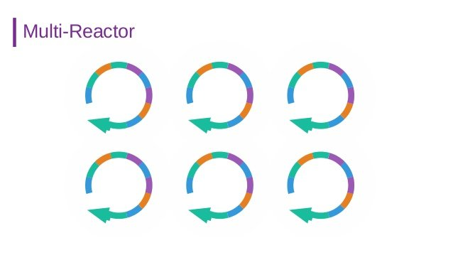
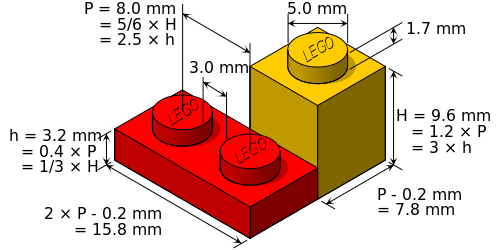

<!-- .slide: data-background-image="media/codemotion.png" data-background-size="contain" -->

<!--
< ! - - .slide: style="text-align: left;" - - >
# 10 things
#### I learned making the fastest js server runtime in the world

<div style="font-size: 0.6em">
  **Paulo Lopes**<br/>
  <i class="fab fa-redhat"></i> Principal Software Engineer
</div>
-->

Notes:
  From up here, I can see such a diverse group of people, but we all share one thing in common...
  
  We all love JavaScript and building fast applications. 

  This topic is something that I enjoy working, and I could be talking about it forever, sadly we don't have much time, so I've to condense it. If you would like to discuss it later, feel free to reach me on twitter or catch me and say hi!.

---



Notes:
  I started learning JavaScript back in the days of Netscape Navigator almost at the same time I started with Java. I constantly switch languages so if you see me coding, you will see that I always get the lambda shorthand notation wrong the first time. Exploring other languages and runtimes in fun (you should try it). I'll talk about my experiments in this area.

---
<!-- .slide: style="text-align: left;" -->

## #1:
#### Define fast server

Notes:
  When I was planning this talk, I needed a title. I end up with "10 things I learned making the fastest js server runtime in the world". I carefully decided to choose the word "server".

---
<!-- .slide: style="text-align: left;" -->

**server** <small>noun</small><br/>
&nbsp;&nbsp;&nbsp;&nbsp;<small>*serv·​er | \ ˈsər-vər\\*</small>

> <small>*a computer in a network that is used to provide services (such as access to files or shared peripherals or the routing of e-mail) to other computers in the network*</small>

Notes:
  What this means is that what I'm about to tell, fully applies to servers but is not necessarily true for your command line applications, lambdas or browser applications.

  Let me ask you, what does fast server mean? A raspberry pi on a Formula 1 car is faster than your laptop. Although this is true, I'm more interested in using other metrics than physical velocity. The metrics  I choose to define fast come from monitoring server applications. If you're interested in this topic you should have a look at SRE.

---
<!-- .slide: style="text-align: left;" -->

**Site Reliability Engineering**

<small>*is a discipline that incorporates aspects of software engineering and applies them to infrastructure and operations problems. The main goals are to create ultra-scalable and highly reliable software systems*</small>


https://landing.google.com/sre/books/

Notes:
  Google has one of the greatest SRE teams out there, they wrote books you can read in the link above.

  The SRE team identified 5 golden signals. Golden signals are critical for ops teams to monitor their systems and identify problems. These signals are especially important as we move to microservices and containers.

---
<!-- .slide: style="text-align: left;" -->

**Site Reliability Engineering metrics**

* Rate<span class="fragment"> <small>* —  Request rate, in requests/sec*</small></span>
* Errors <span class="fragment"><small>* —  Error rate, in errors/sec*</small></span>
* Latency <span class="fragment"><small>* —  Response time, including queue/wait time*</small></span>
* <span style="color: #808080">*Saturation*</span>
* <span style="color: #808080">*Utilization*<span>

Notes:
  There are many metrics to monitor, but industry experience has shown that: rate, errors, latency, saturation and utilization, contain virtually all the information you need to know what’s going on and where.

  Getting these signals is quite challenging and varies a lot by service and tooling available. For now I'm just considering:

  * Rate
  * Errors
  * Latency

  Focus on rate, errors and latency means that the focus is on the software we build, not on the Operating System or Hardware.

---
<!-- .slide: style="text-align: left;" -->

## #2:
#### Understand the application lifecycle

Notes:
  A typical server application has a well known set of characteristics.

---
<!-- .slide: style="text-align: left;" -->

**Server Application**

* long running process
* deployed on cloud or bare metal
* attached to a fast network
* "enough" CPU/Memory

Notes:
  A long-running process has different characteristics from a short living process. In a long-running process, startup and warming up times can be irrelevant to the full application lifecycle. Again this isn't true if you're running CLI/functions, or in-browser apps, where startup time is a key factor for user happiness. 

---
<!-- .slide: style="text-align: left;" -->

## #3:
#### Statistics

Notes:
  A common mistake when running performance tests is to look at the results as an average. But if we do this, we're just lying to ourselves.

  When we use basic statistics like mean, median or max they often hide the truth for populations of data. Mean and median tend to hide outliers since the majority of your data is “normal”. In contrast, the max is a hyper-condriac and easily distorted by a single outlier.

---

<div style="display: inline-block; width: 50%; float: left;">
  
  <small>mean - median</small>
</div>
<div style="display: inline-block; width: 50%;" class="fragment">
  
  <small>99 percentile</small>
</div>

Notes:
  Consider the following "average" graph:

  That doesn’t look so bad, does it? Average and median response time is around 50ms and creeps up to 100ms for a little while. A different truth is apparent when you include the 99th percentile:

  Wow! That certainly doesn’t look good at all! At 9:30 am, the mean is telling you “Don’t worry, the average latency is only 75ms”. In contrast, the 99th percentile says “99% of your values are less than 850ms”, which is a very different picture. One percent of all your customers are experiencing 800+ ms latencies, which could be very bad for business.

---
<!-- .slide: style="text-align: left;" -->

## #4:
#### JavaScript runtimes


Notes:
  If I would ask you, what is the first thing that comes to your mind when I say: "javascript engine". I believe most of you just thought: V8

  If we look at V8 mission statement we can read:

---
<!-- .slide: style="text-align: left;" -->

**V8 JavaScript engine**
> <small>*Speed up real-world performance for modern JavaScript, and enable developers to build a faster future web.*</small>

Notes:
  We all learned to love it and respect it as the heart under node.js. Its performance is amazing, and we quickly realized that. The internet got a boom of blogs and articles about how node.js is fast, faster than "pretty much everything" right?

---
<!-- .slide: data-background-image="media/kangax.png" -->

Notes:
  But did you know that there are a bunch of other engines out there? Don't believe me? Just look at the "kangax" table. "Kangax-table" is not an authority in JS engines, it lists the compatibility of ES6 across many. You can see:

  * Edge (Chakra)
  * Firefox (spider monkey)
  * Chrome (V8)
  * Safari (ScriptCore)
  * Node (V8)
  * Nashorn (old Java)
  * GraalVM (new Java)
  * DUK

---
<!-- .slide: style="text-align: left;" -->

## #5:
#### Benchmark

Notes:
  Most articles will tell you how fast something is, but most of the time, the information on how the tests were performed is ommited. As an engineer, this is not how things should be done. We should be able to reproduce the same experiment in a lab environment and achieve the same results.

  The experiment should be peer reviewed so we can confirm that the results are not biased and that the tests are fair to all participants.

  Writing benchmarks is hard. First, every benchmark will not fully represent a real-world use case. Getting peers to review your code can be hard to obtain. Getting peers to tests against, and willing to review your work can be even harder.

---
<!-- .slide: data-background-image="media/TechEmpower.png" data-background-size="contain" -->

Notes:
  Luckily there is an open source project "Techempower Framework Benchmarks" that attempted to build this for the last couple of years. The project has grown so much that it currently tests more than 600 different frameworks. The project has contributions from around 500 developers, that submitted their code and peer-reviewed the competition.

  TechEmpower has built a good reputation with so many contributors and tests that are hard to ignore. So let's have a look, where javascript ranks.

---
<!-- .slide: style="text-align: left;" -->

## Techempower Framework Benchmarks

#### Commits: **10715**     <!-- .element: class="fragment" -->
#### Contributors: **504**  <!-- .element: class="fragment" -->

<small>https://github.com/TechEmpower/FrameworkBenchmarks/</small>

---
<!-- .slide: data-background-image="media/round17.png" data-background-size="contain" -->

Notes:
  As shocking as it can be, the first entry to JavaScript ranks at #68 which performs at 28% of the rate, of the best result.

---
<!-- .slide: style="text-align: left;" -->

## #6:
#### Question the Status Quo

Notes:
  Here things start to get interesting! So JS is fast... but not as we would like it to be. This isn't new, there are reports of big players that moved from node to Go or Rust. As an engineer I decided to go on a mission to find out why. Are we all living in a bubble? Is JS really bad?

---

<!-- .element: class="stretch" --> 

<small>Source (2014): http://blog.kazuhooku.com</small>

---
<!-- .slide: style="text-align: left;" -->

**Recap**

1. we want fast as in fast server
2. <!-- .element: class="fragment" --> server as in a long-running process
3. <!-- .element: class="fragment" --> monitor rates, latency (and errors)
4. <!-- .element: class="fragment" --> JS is more than V8/node
5. <!-- .element: class="fragment" --> **results** must be peer-reviewed and verifiable

---
<!-- .slide: style="text-align: left;" -->

## #7:
#### Look under the hood

Notes:
  Before we can do any optimization, we need to understand what is going on. We shouldn't jump into conclusions and just start tweaking the benchmark code. If we do that we will just be Yak shaving. Instead we need to take a scientific approach. If you haven't learned about profiling node applications, I'd recommend you to read the very good tutorial on nodejs website on profiling. Kudos for the documentation explaining flamegraphs.

---

```js
const http = require('http');

http
  .createServer((request, response) => {
    response.end("Hello World\n");
  })
  .listen(8000);
```

<small>https://nodejs.org/en/blog/uncategorized/profiling-node-js</small>

---
<!-- .slide: data-background-image="media/flamegraph.png" data-background-size="contain" -->

Notes:
  If we look at the flamegraph you will see the following:

  Each box represents a function in the stack (a "stack frame").

  The y-axis shows stack depth (number of frames on the stack). The top box shows the function that was on-CPU. Everything beneath that is ancestry. The function beneath a function is its parent.

  The x-axis spans the sample population. It does not show the passing of time from left to the right, as most graphs do. The left to right ordering has no meaning (it's sorted alphabetically to maximize frame merging).

  The width of the box shows the total time it was on-CPU or part of an ancestry that was on-CPU (based on sample count). Functions with wide boxes may consume more CPU per execution than those with narrow boxes, or, they may simply be called more often.

  The colors aren't significant and are usually picked at random to be warm colors.

  What is important to see here is that most of the time (and this may come as a shocker to you) is spent on native code (lib UV, libstdc++, libc) so what this flamegraph tells us is that if we want to optimize we need to focus on the non-JS part.

---

<!-- .element: class="stretch" --> 

---
<!-- .slide: style="text-align: left;" -->

## #8:
#### Try other engines

Notes:
  Most of the CPU usage on our server happens in the native part. So what if we look at other engines?  After running several experiments I've settled on GraalVM.

---
<!-- .slide: style="text-align: left;" -->

**Graal**


https://graalvm.org

Notes:
  GraalVM is an extension of the Java virtual machine to support more languages and execution modes. The Graal project includes a new high-performance Java compiler, itself called Graal, which can be used in a just-in-time configuration on the HotSpot VM.

  One objective of Graal is to improve the performance of Java virtual machine-based languages to match the performance of native languages. Another goal is to allow freeform mixing of code from any programming language in a single program, billed as "polyglot applications".

  So GraalVM offers a great new modern JS runtime. If you paid attention to the benchmark results, Java frameworks rank very well, so my goal was to mix the 2.

  The goal is to have a fast server, BUT, I'm not accepting switching from JavaScript to another language. I want Javascript period.

---
<!-- .slide: style="text-align: left;" -->

#### Graal <small>vs</small> Graal.js <small>vs</small> Node.js



<small>https://stefan-marr.de/papers/dls-marr-et-al-cross-language-compiler-benchmarking-are-we-fast-yet/</small>

---
<!-- .slide: style="text-align: left;" -->

**Eclipse Vert.x**

<small>*Eclipse Vert.x is a **polyglot** **reactive** application framework that runs on the Java Virtual Machine*</small>

https://vertx.io

Notes:
  What is this Vert.x thing? 

  Vert.x is a small library optimized for high-performance IO. It utilizes similar concepts to nodejs with its event loop (reactor pattern) but takes it further with the (multi-reactor pattern)

---

<div style="display: inline-block; width: 50%; float: left;">
  
  
</div>
<div style="display: inline-block; width: 50%;">
  
  
</div>

Notes:
  ⏭ "Instead of a single event loop, each Vertx instance maintains several event loops.

  Even though a Vertx instance maintains multiple event loops, any particular handler will never be executed concurrently, and in most cases (with the exception of worker verticles) will always be called using the exact same event loop."

  ⏭ Being polyglot means that even though it runs on the Java Virtual Machine, it does not require you to write your application in Java.

  ⏭ The project is a simple library, which makes it modular and embedable in any other application.

---
<!-- .slide: style="text-align: left;" -->

## #9:
#### UNIX Principle

Notes:
  Conducting such experiment needs to be simple, it would be an impossible task to re-implement what node already offers to us these days, instead, my goal was to have a minimal set of features to make it easy to use. 
  
  Vert.x supports JavaScript out of the box, BUT, it used now deprecated Nashorn engine, so as an experiment I started a project making it compatible with Graal. I called this project: EcmaScript for Vert.x (or simply ES4X).

---
<!-- .slide: style="text-align: left;" -->

## Graal.js<span class="fragment"> + Vert.x</span><span class="fragment"> = ES4X</span>

<span class="fragment">https://github.com/reactiverse/es4x</span>

---
<!-- .slide: style="text-align: left;" -->

**ES4X Features**
* **`commonjs`** loader
* **`npm`** compatibility (no native modules for now)
* **`.d.ts`** definitions for the java APIs
* debug/profile using **chrome-devtools**

<small>https://reactiverse.io/es4x</small>

---
<!-- .slide: style="text-align: left;" -->

**CLOC stats**

| Language  |  files |   blank | comment |     code |
| :-------- | -----: | ------: | ------: | -------: |
|Java       |     21 |     318 |     584 |     1393 |
|JavaScript |     10 |     148 |     253 |      887 |
|JSON       |      1 |       1 |       0 |       51 |
|**SUM:**   | **32** | **467** | **837** | **2331** |

[http://github.io/reactiverse/es4x](http://github.io/reactiverse/es4x)

Notes:
  The result is a small project made of <1400 lines of java code and <900 lines of JavaScript that takes advantage of Vert.x for high-performance IO and GraalVM for running JavaScript code.

  Let me show you how you would write one of the tests:

---

<asciinema-player src="cast/es4x.cast" rows="20" cols="80"></asciinema-player>

Notes:
  Ctrl + Click to zoom

---
<!-- .slide: style="text-align: left;" -->

## #10:
#### Verify the results

Notes:
  Several months ago, I submitted an implementation of the benchmark using this experiment. After review, it got accepted. Here is how things are:

---
<!-- .slide: data-background-image="media/es4x-single.png" data-background-size="contain" -->

Notes:
  JavaScript now ranks at #6 overall and the best in JavaScript in general but a far margin.

---
<!-- .slide: data-background-image="media/es4x-multi.png" data-background-size="contain" -->

Notes:
  JavaScript now ranks at #5 overall and the best in JavaScript in general but a far margin.

---
<!-- .slide: style="text-align: left;" -->

## How does it compare?

---
<!-- .slide: data-background-image="media/1.png" data-background-size="contain" -->

---
<!-- .slide: data-background-image="media/2.png" data-background-size="contain" -->

---
<!-- .slide: data-background-image="media/3.png" data-background-size="contain" -->

---
<!-- .slide: data-background-image="media/5.png" data-background-size="contain" -->

---
<!-- .slide: style="text-align: left;" -->

## Conclusion

* *There's nothing wrong with **JavaScript***.
* <!-- .element: class="fragment" --> Yes **JavaScript** is **fast**
* <!-- .element: class="fragment" --> You don't need to switch to Go/Rust/etc...
* <!-- .element: class="fragment" --> *Dare to **Experiment***

Notes:
  So the final tip is that optimization is a never-ending job, for example, we can get better results if we run with the Enterprise Edition of GraalVM instead of the Open Source edition. All the results would be improved by about 20%, perhaps you can think of other tricks.

  And now we rinse and repeat... It's a never ending job!

  If you would like to improve this experiment even further, check the GitHub repo, look at my ugly code and let's make it even better!

---
<!-- .slide: style="text-align: left;" -->

# Thank you!

* <i class="fab fa-twitter"></i> `@pml0pes`
* <i class="fab fa-github"></i> `pmlopes`
* https://reactiverse.io/es4x
* https://vertx.io
* https://graalvm.org