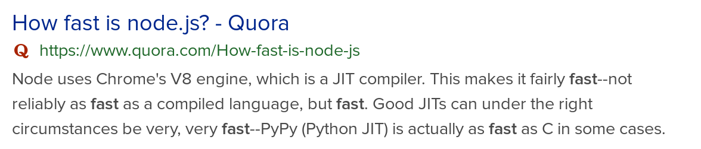
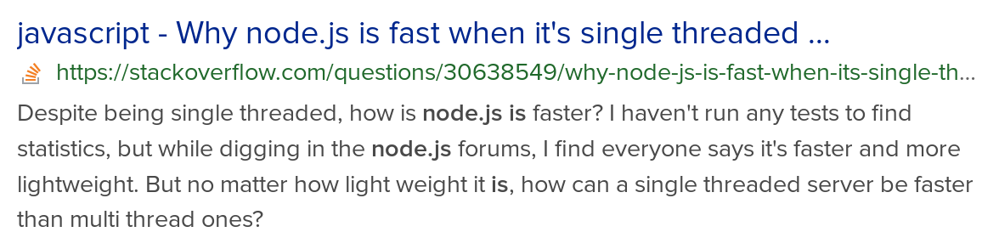
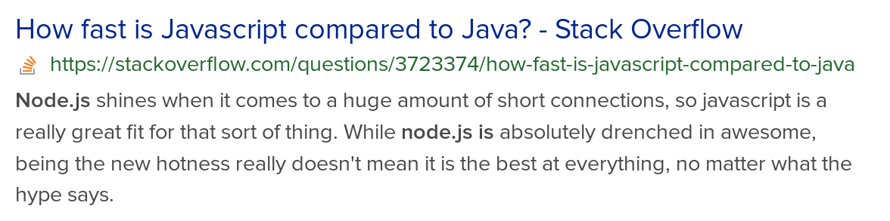
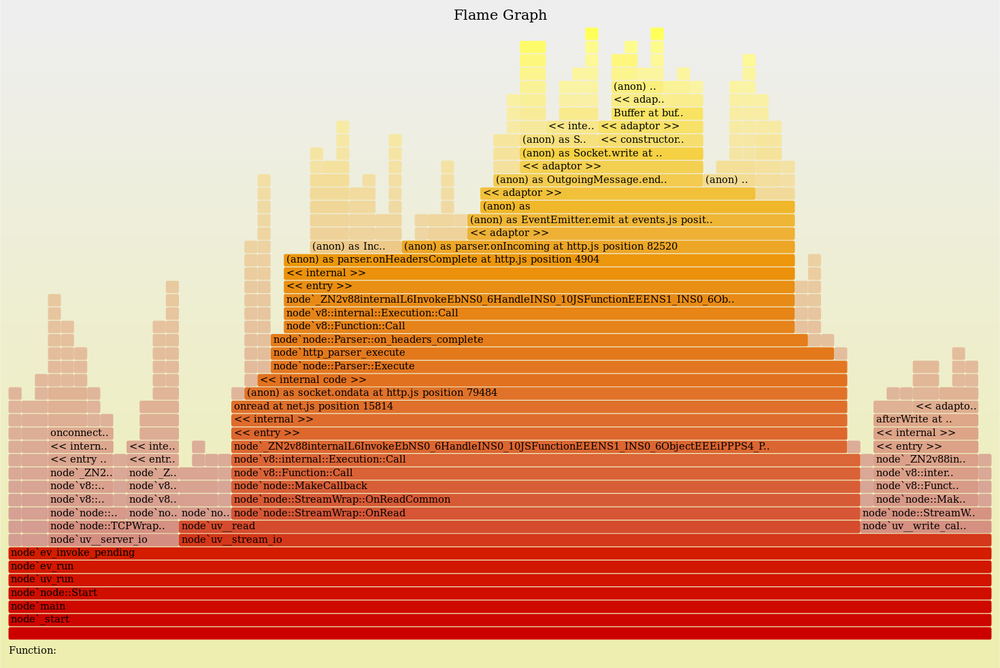
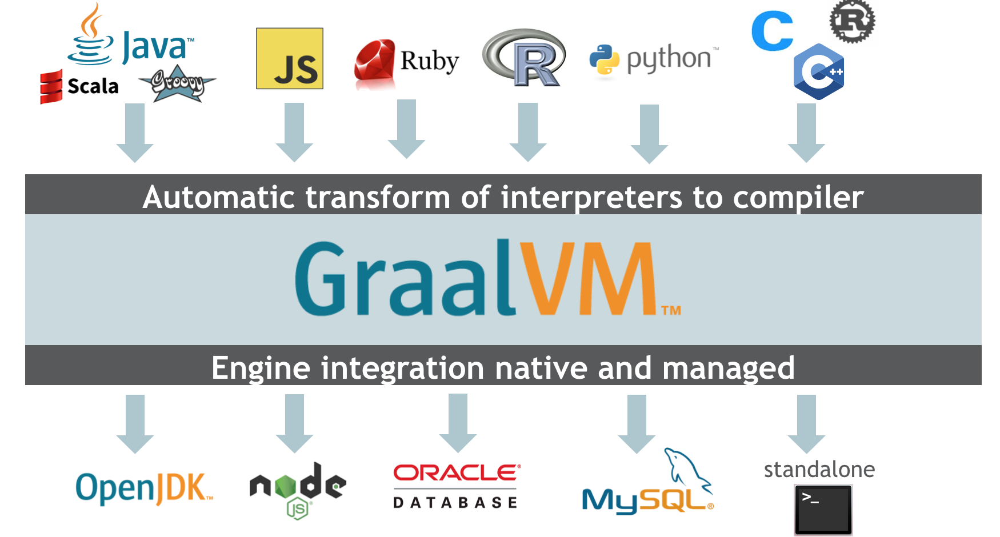

<!-- .slide: style="text-align: left;" -->
# 10 things
#### I learned making the fastest js server runtime in the world

<div style="font-size: 1em">
  <br/>
  **Paulo Lopes**<br/>
  Principal Software Engineer<br/>
   <!-- .element style="max-width:20%; max-height:20%;" -->
</div>

Notes:
  Raise your hand if you believe JavaScript is slow!

  By the end of this talk I hope to not see any hands in the air.

  Before we start, there are several questions I would like to ask:

---




Notes:
  How fast is js?

  Your favourite search engine will probably say:

  > under the right circumstances it's very very fast, actually as as as C

---


Notes:
  Why is JS so fast?

  > as soon you understand the eventloop and how it processes requests, you realise why it is so fast!

---




Notes:
  How can it be fast it it's single threaded?

  > because it's lightweight   

---




Notes:
  How fast is it compared to Java?

  > js is awesome and hot, and shines when it comes to a huge amount of short connections

---


Notes:
  But... What makes it faster than Java?

  > Because the async ecosystem has more than 50k modules written in asynchronous style.

---
<!-- .slide: style="text-align: left;" -->

### Do we trust the Internet?
#### 🤫 I don't! <!-- .element: class="fragment" -->

Notes:
  Given all these questions, I have to ask:

  Do we trust the internet?

  The internet is full of stories, stories connect us...

  However stories are not exact science. Above all they are not what should drive an software engineer.

---
<!-- .slide: style="text-align: left;" -->

**engineering** <small>noun</small><br/>
&nbsp;&nbsp;&nbsp;&nbsp;<small>*en·​gi·​neer·​ing | \ ˌen-jə-ˈnir-iŋ\\*</small>

> <small>*the application of science and mathematics by which the properties of matter and the sources of energy in nature are made useful to people.*<br><br>(Merriam-Webster)</small>

Notes:
  As an engineer, we should apply science and mathmatics to the way we solve our software problems.

---


# 🤷 <!-- .element: class="fragment" -->

Notes:
  In order to anwser the question:

  > Is javascript fast?

  We must be able to reproduce the problem, and we must be able to explain and reproduce the results.

  So I'm sorry to say but the right answer is:

---
<!-- .slide: style="text-align: left;" -->

## #1:
#### Define server

Notes:
  When I was planning this talk, I needed a title. I end up with "10 things I learned making the fastest js server runtime in the world". I carefully decided to choose the word "server".

---
<!-- .slide: style="text-align: left;" -->

**server** <small>noun</small><br/>
&nbsp;&nbsp;&nbsp;&nbsp;<small>*serv·​er | \ ˈsər-vər\\*</small>

> <small>*a computer in a network that is used to provide services (such as access to files or shared peripherals or the routing of e-mail) to other computers in the network.*<br><br>(Wikipedia)</small>

Notes:
  A server is a computer in a network that is used to provide services to other computers in the network.

  What I'm about to tell, fully applies to servers but is not necessarily to your command line applications, lambdas or browser applications.

---
<!-- .slide: style="text-align: left;" -->

## #2:
#### Define fast

Notes:
  What does fast server mean? We need to agree in a common set of metrics. The metrics I choose to define fast come from monitoring server applications. If you're interested in this topic you should have a look at SRE.

---
<!-- .slide: style="text-align: left;" -->

**Site Reliability Engineering**

<small>*is a discipline that incorporates aspects of software engineering and applies them to infrastructure and operations problems. The main goals are to create ultra-scalable and highly reliable software systems*</small>


https://landing.google.com/sre/books/

Notes:
  Google has one of the greatest SRE teams out there, they wrote books you can read in the link above.

  The SRE team identified 5 golden signals. Golden signals are critical for ops teams to monitor their systems and identify problems. These signals are especially important as we move to microservices and containers.

---
<!-- .slide: style="text-align: left;" -->

**Site Reliability Engineering metrics**

* Rate<span class="fragment"> <small>* —  Request rate, in requests/sec*</small></span>
* Errors <span class="fragment"><small>* —  Error rate, in errors/sec*</small></span>
* Latency <span class="fragment"><small>* —  Response time, including queue/wait time*</small></span>
* <span style="color: #808080">*Saturation*</span>
* <span style="color: #808080">*Utilization*<span>

Notes:
  There are many metrics to monitor, but industry experience has shown that: rate, errors, latency, saturation and utilization, contain virtually all the information you need to know what’s going on and where.

  Getting these signals is quite challenging and varies a lot by service and tooling available. For now I'm just considering:

  * Rate
  * Errors
  * Latency

  Focus on rate, errors and latency means that the focus is on the software we build, not on the Operating System or Hardware.

---
<!-- .slide: style="text-align: left;" -->

## #3:
#### Understand the environment/lifecycle

Notes:
  A typical server application has a well known set of characteristics.

  We need to know how the application behaves before anything can be said about it.

  What is a "Server Application" then?

---
<!-- .slide: style="text-align: left;" -->

**Server Application**

* long running process <!-- .element class="fragment" -->
* deployed on cloud or bare metal <!-- .element class="fragment" -->
* attached to a fast network <!-- .element class="fragment" -->
* "enough" CPU/Memory <!-- .element class="fragment" -->

Notes:
  A server application is:

  * long running process
  * deployed on cloud or bare metal
  * attached to a fast network
  * "enough" CPU/Memory

  A long-running process has different characteristics from a short living process. In a long-running process, startup and warming up times can be irrelevant to the full application lifecycle. Again this isn't true if you're running CLI/functions, or in-browser apps, where startup time is a key factor for user happiness. 

---
<!-- .slide: style="text-align: left;" -->

## #5:
#### Measure / Benchmark

Notes:
  Most articles will tell you how fast something is, but most of the time, the information on how the tests were performed is ommited. From an engineering perspective, this is incorrect. We should be able to reproduce the same experiment in a lab environment and achieve the same result.

  The experiment should be peer reviewed so we can confirm that the results are not biased and that the tests are fair to all participants.

  Writing benchmarks is hard. First, every benchmark will not fully represent a real-world use case. Getting peers to review your code can be hard to find. Getting peers to tests against, and willing to review your work can be even harder.

---
<!-- .slide: style="text-align: left;" -->

## Benchmarking is hard
* *Meaningful benchmarks are even harder*
* <!-- .element: class="fragment" --> Techempower Framework Benchmarks
  * <!-- .element: class="fragment" --> Contributors: **512**
  * <!-- .element: class="fragment" --> Pull Requests: **3824**
  * <!-- .element: class="fragment" --> Commits: **10900**

<small class="fragment">https://github.com/TechEmpower/FrameworkBenchmarks/</small>

Notes:
  Benchmark is hard!

  However there is a very popular benchmark named "Techempower Framework Benchmarks".

  This benchmark has more than 500 contributors, it has merged more the 3000 pull requests and the total amount of commits is over 10000.

  There are tests for 630 different frameworks in many different languages so this makes my life easier as I don't need to prove the quality of the benchmark and the contributors will review all results.

---
<!-- .slide: data-background-image="media/TechEmpower.png" data-background-size="contain" -->

Notes:
  TechEmpower has built a good reputation with so many contributors and tests that are hard to ignore. So let's have a look, where javascript ranks.

  Since the list is very long, I've rotated the screen and cut it so you can understand the problem.

  Quick question: Where is the best JavaScript framework on this graph?

---
<!-- .slide: data-background-image="media/TechEmpower2.png" data-background-size="contain" -->

Notes:
  As shocking as it can be, the first entry to JavaScript ranks at #89 which performs at 22.7% of the rate, of the best result.

---
<!-- .slide: style="text-align: left;" -->

## #6:
#### Look under the hood

Notes:
  Before we can do any optimization, we need to understand what is going on. We shouldn't jump into conclusions and just start tweaking the code. If we do that we will just be Yak shaving. Instead we need to take a scientific approach. If you haven't learned about profiling node applications, I'd recommend you to read the very good tutorial on nodejs website on profiling.

---

```js
const cluster = require('cluster'),
  numCPUs = require('os').cpus().length,
  express = require('express');

if (cluster.isMaster) {
  for (let i = 0; i < numCPUs; i++)
    cluster.fork();
} else {
  const app = module.exports = express();
  app.get('/plaintext', (req, res) =>
    res
      .header('Content-Type', 'text/plain')
      .send('Hello, World!'));
}
```

Notes:
  Let's look at this code. This is a small portion of one of the benchmark tests. As you can see a typical express server is created and we use the cluster API to utilize the total amount of CPU cores available.

---

### Analize

<!-- .element: class="stretch" --> 

Notes:
  When we profile and analize this application using a flamegraph as a visualization tool, one thing can be observed. You will probably not see any block (or the block is too small) that refers to the code I've just shown you.

---

### Observe

<!-- .element: class="stretch" --> 

Notes:
  This is because, if we look how the runtime works, the large majority of the work is done not on the javascript code, but on native code. If you recall the previous flamegraph, the vast majority of the code is spent in the libuv and v8.

---

### You can only optimize

<!-- .element: class="stretch" --> 

Notes:
  What I am trying to tell you is that you can only optimize the tip of the iceberg.

---

# 🤔

Notes:
  Interesting...

---
<!-- .slide: style="text-align: left;" -->

## #7:
#### JavaScript runtimes


Notes:
  If I would ask you, what is the first thing that comes to your mind when I say: "javascript engine". I believe most of you just thought: V8

---
<!-- .slide: style="text-align: left;" -->

**V8 JavaScript engine**
> <small>*Speed up real-world performance for modern JavaScript, and enable developers to build a faster future web.*</small>

Notes:
  If we look at V8 mission statement we can read:

  > Speed up real-world performance for modern JavaScript, and enable developers to build a faster future web

  Its performance is amazing, we all agree with that. But we also know that there are other engines out there too.

---

### More engines

* <!-- .element: class="fragment" style="color: #808080" --> ChakraCore
* <!-- .element: class="fragment" style="color: #808080" --> SpiderMonkey
* <!-- .element: class="fragment" style="color: #808080" --> ScriptCore
* <!-- .element: class="fragment" --> **Graaljs**

Notes:
  The "Kangax-table" (which is not an authority in JS engines), lists the compatibility of ES6 across many. There you can see:

  * Edge (Chakra)
  * Firefox (spider monkey)
  * Safari (ScriptCore)
  * Graal (new Java)

---
<!-- .slide: style="text-align: left;" -->

## #8:
#### Try other engines

Notes:
  Most of the CPU usage on our server happens in the native part. So what if we look at other engines?  After running several experiments I've settled on Graal.

---
<!-- .slide: style="text-align: left;" -->

**Graal**


https://graalvm.org

Notes:
  GraalVM is an extension of the Java virtual machine to support more languages and execution modes. The Graal project includes a new high-performance compiler, itself called Graal, which can be used in a just-in-time compiler.

  One objective of Graal is to improve the performance of Java virtual machine-based languages to match the performance of native languages. Another goal is to allow freeform mixing of code from any programming language in a single program, billed as "polyglot applications".

  So GraalVM offers a great new modern ES2019/ES2020 runtime. If you paid attention to the benchmark results, Java frameworks rank very well, so my goal was to mix the 2.

  The goal is to have a fast server, BUT, I'm not switching from JavaScript to another language.

---

## GraalJS

<i>

* JavaScript with best possible performance
* Full latest ECMAScript specification
* Fast interoperability
  * Java, Scala, or Kotlin, ...
  * or GraalVM Ruby, Python, or R ...

</i>

<small>https://github.com/graalvm/graaljs</small>

Notes:
  Graaljs goals are:

  * Execute JavaScript code with best possible performance
  * full support for the latest ECMAScript specification
  * Fast interoperability with Java, Scala, or Kotlin, or with other GraalVM languages like Ruby, Python, or R

---
<!-- .slide: style="text-align: left;" -->

#### Graal <small>vs</small> Graal.js <small>vs</small> Node.js


<small>https://stefan-marr.de/papers/dls-marr-et-al-cross-language-compiler-benchmarking-are-we-fast-yet/</small>

Notes:
  Academic research has shown that graal engine can be on par or be better than V8 for language benchmarks. This is a paper you can read about it if you're interested.

---

### Hypothesis


Notes:
  So let's formulate an hypothesis. What if I create a project which I will call EcmaScript for X that...

---
<!-- .slide: style="text-align: left;" -->

### ES4X
* <!-- .element: class="fragment" --> ~~V8~~ `=>` GraalJS <small>(https://graalvm.org)</small>
* <!-- .element: class="fragment" --> ~~libUV~~ `=>` Eclipse Vert.x  <small>(https://vertx.io)</small>
* <!-- .element: class="fragment" --> ~~V8 JIT~~ `=>` GraalVM JVMCI <small>(https://graalvm.org)</small>
* <!-- .element: class="fragment" --> ~~node bindings`~~ `=>` **`.d.ts`** of Java APIs
* <!-- .element: class="fragment" --> **`commonjs and ESM`** loader
* <!-- .element: class="fragment" --> **`npm`** compatibility (no native modules for now)
* <!-- .element: class="fragment" --> debug/profile using **chrome-devtools**

<small>https://reactiverse.io/es4x</small>

Notes:
  Replaces:

  * V8 with Graal
  * LibUV with Eclipse Vert.x
  * V8 JIT with Graal compiler
  * node bindings with typescript definitions which are discarded at runtime

  Offers:

  * commonjs and ESM loader
  * basic npm compatibility
  * integrates with Chrome devtools and any Java monitoring tool

---

```js
import { Router } from '@vertx/web';

const app = Router.router(vertx);

app.get("/plaintext").handler(ctx => {
  ctx.response()
    .putHeader("Content-Type", "text/plain")
    .end('Hello, World!');
});
```

Notes:
  This is how the old express code is written in ES4X. I guess it won't be hard to follow. Important thing to notice is that Vert.x will by default use all the available cores, so no need to use a cluster module. Vert.x provides a async IO API build on top of Netty which is used by big names: google, twitter, netflix to name a few...

---
<!-- .slide: data-background-video="media/cast.webm.mp4" data-background-size="contain" -->

Notes:
  Let me quickly show how it works...

---
<!-- .slide: style="text-align: left;" -->

### Expectation: 

* <!-- .element: class="fragment" --> User code (JavaScript)
* <!-- .element: class="fragment" --> **+** Runtime (ES4X)
* <!-- .element: class="fragment" --> **+** Interop JS `<->` Java
* <!-- .element: class="fragment" --> **+** JS Engine (GraalJS)
* <!-- .element: class="fragment" --> **+** IO library (vert.x)
* <!-- .element: class="fragment" --> **+** JDK
* <!-- .element: class="fragment" --> **= Full application optimization** 🚀

Notes:
  The expected result is that the:

  * User code (JavaScript)
  * Runtime (ES4X)
  * Interop JS `<->` Java
  * JS Engine (GraalJS)
  * IO library (vert.x)
  * JDK

  Will **ALL** be optimized by graal, not just the script itself.

---
<!-- .slide: style="text-align: left;" -->

## #9:
#### Test experiment

Notes:
  Several months ago, I submitted an implementation of the benchmark using this experiment. After review, it got accepted. Here is how things are:

---
<!-- .slide: data-background-image="media/es4x-single.png" data-background-size="contain" -->

Notes:
  JavaScript now ranks at #5 overall and the best in JavaScript in general but a far margin.

---
<!-- .slide: data-background-image="media/es4x-multi.png" data-background-size="contain" -->

Notes:
  JavaScript now ranks at #6 overall and the best in JavaScript in general but a far margin.

---
<!-- .slide: style="text-align: left;" -->

## #10:
## How does it compare?

Notes:
  How does it compare to the other javascript frameworks out there?

---
<!-- .slide: data-background-image="media/1.png" data-background-size="contain" -->

Notes:
  More than 2 times better that the previous best javascript framework when working with JSON

---
<!-- .slide: data-background-image="media/2.png" data-background-size="contain" -->

Notes:
  Almost 3,5 times better than the previous best, but to be fair **6** times better when comparing to the previous best using postgres

---
<!-- .slide: data-background-image="media/3.png" data-background-size="contain" -->

Notes:
  2,5 times better when performing lots of database operations per request  

---
<!-- .slide: data-background-image="media/5.png" data-background-size="contain" -->

Notes:
  More than 5 times better when doing database updates

---

### Req/sec

| Node*   | ES4X**        | Test           |
| -------:| -------------:| -------------- |
| 558,261 | **1,146,774** | JSON           |
| 195,638 | **677,568**   | Single Query   |
| 17,458  | **42,974**    | Multiple Query |
| 4,967   | **21,182**    | Data Updates   |
| 881,321 | **2,268,524** | Plaintext      |

<small>Higher is better</small>

Notes:
  As you can see I'm not talking about small tiny improvements, I'm talking about huge improvements!

---
<!-- .slide: style="text-align: left;" -->

## Conclusion

* *There's nothing wrong with **JavaScript***.
* <!-- .element: class="fragment" --> Yes **JavaScript** is **fast**
* <!-- .element: class="fragment" --> You don't need to switch to Go/Rust/etc...
* <!-- .element: class="fragment" --> *Dare to **Experiment***

Notes:
  So the final tip is that optimization is a never-ending job, for example, we can get better results if we run with the Enterprise Edition of Graal instead of the Open Source edition. All the results would be improved by about 20% and perhaps you can think of other tricks.

  And now we rinse and repeat... It's a never ending job!

  If you would like to improve this experiment even further, check the GitHub repo, look at my ugly code and let's make it even better!

---
<!-- .slide: style="text-align: left;" -->

# Thank you!

* <i class="fab fa-twitter"></i> `@pml0pes`
* <i class="fab fa-github"></i> `pmlopes`
* https://reactiverse.io/es4x
* https://vertx.io
* https://graalvm.org