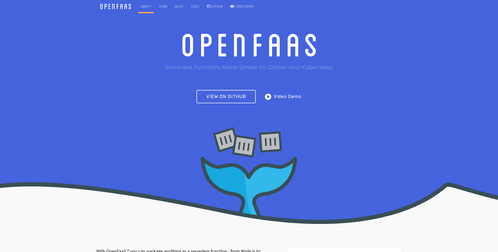

### *Native images for fun and profit!*

Notes:

---

## *Who am I?*

* Discovered Java in 1997 (1.0.2b)
* Java Developer since 1998 (1.1.4)
* <!-- .element class="fragment" --> Eclipse Vert.x Core Developer
* <!-- .element class="fragment" --> RedHat Principal Software Engineer
* <!-- .element class="fragment" --> <small>Likes JavaScript</small>

Notes:

---

## Once upon the time...
### (In a nutshell)
---

| Release | Date     | Features | JRE installer |
| ------- |:---------|:------------|-----------:|
| 1.1     | Feb 1997 | **Interpreted** | 2.61MB     |
| 1.2     | Dec 1998 | JIT         | **11.94MB**    |
| 1.4     | Feb 2002 | Lots!!!     | **13.52MB**    |
| 1.5     | Sep 2004 | Generics    | **15.8MB**     |
| 1.6     | Dec 2006 | JavaScript  | **15.55MB**    |
| 1.7     | Jul 2011 | `java.nio`  | **31.18MB**    |
| 1.8     | Mar 2014 | `() -> {}`  | **61.55MB**    |

Notes:

---

### Java is **Slow**
### Java is **Bloated**

Notes:

---

## Lies, lies and more lies...

<!-- .element class="stretch" --> 

<small>https://www.techempower.com/benchmarks</small>

Notes:

---

## Lies, lies and more lies...

<!-- .element class="stretch" --> 

<small>https://www.techempower.com/benchmarks</small>

Notes:

---

## Well...

---

## Just In Time Compiler

> JIT causes a slight to noticeable delay in initial execution of an application

Notes:
  In general, the more optimization JIT performs, the better the code it will generate, but the initial delay will also increase. A JIT compiler therefore has to make a trade-off between the compilation time and the quality of the code it hopes to generate. Startup time can be increased IO-bound operations in addition to JIT compilation: for example, the rt.jar class data file for the Java Virtual Machine (JVM) is 40 MB and the JVM must seek a lot of data in this contextually huge file.

---

## I've told you so!

---

## So what is Graal(VM)?

> Graal is a native code generator. You give it some intermediate model of executable code, and then you get native code for processors.

Notes:
  Once you have a code generator, you can do many other things such as a compiler to native code for some language, you can do a JIT (just-in-time) compiler for another language, etc.

---

## GraalVM subprojects

* JIT
* Truffle languages (JS, Ruby, R, Python, LLVM, etc...)
* Oracle DB stuff
* **SubstrateVM**

Notes:
  What excites people so much about GraalVM is a sub-project called SubstrateVM (SVM), and that compiles JVM applications to native executables. This is also called a ahead-of-time compiler.

---

## SubstrateVM

> Substrate VM is a framework that allows ahead-of-time (AOT) compilation of Java applications under closed-world assumption into executable images or shared objects (ELF-64 or 64-bit Mach-O).

---

## SubstrateVM `!=` JVM

---

| What                                      | Status    |
| ----------------------------------------- | ----------|
| Dynamic Class (Un)Loading                 | ✘ |
| Reflection                                | Mostly |
| Dynamic Proxy                             | Mostly |
| InvokeDynamic/Method Handles              | ✘ |
| Threads                                   | ✔ |
| Synchronized, wait, and notify            | ✔ |
| Security Manager                          | ✘ |
| References                                | Mostly |

Notes:

---

| What                                      | Status    |
| ----------------------------------------- | ----------|
| Finalizers                                | ✘ |
| Java Native Interface (JNI)               | Mostly |
| Unsafe Memory Access                      | Mostly |
| Static Initializers                       | Partially |
| Lambda Expressions                        | ✔ |
| Identity Hash Code                        | ✔ |
| JVMTI, JMX, other native VM interfaces    | ✘ |

---

## The Bad News...

* Not every application can be compiled to SVM
* **There is no JIT** (It's AOT remember?)
* **GC is simpler**

---

## The Good news...

* <!-- .element class="fragment" --> Vert.x works <small>(mileage varies greatly depending on your stack)</small>
* <!-- .element class="fragment" --> Out of the box <small>web, redis, postgres, gRPC, sockjs, websockets, etc...</small>
* <!-- .element class="fragment" --> `cli` or `serverless`
* <!-- .element class="fragment" --> Low resources
* <!-- .element class="fragment" --> Fast startup

---

## Fighting back!

* <!-- .element class="fragment" --> `-H:+ReportUnsupportedElementsAtRuntime`
* <!-- .element class="fragment" --> `--delay-class-initialization-to-runtime=FQCN`
* <!-- .element class="fragment" --> `reflection.json`
* <!-- .element class="fragment" --> `substitutions.java`

---

## Demo(s)

---

## 1. Realtime bitcoin viewer

---

## Dependencies:

* Vert.x core (3.6.0)
  * <small>EventBus, HTTP Server, WebSocketClient</small>
* Vert.x web (3.6.0)
  * <small>HTTP Routing, WebSocketServer, Eventbus Bridge</small>
* Postgres + reactive-pg-client (0.10.2)
  * <small>Postgres SQL client</small>

---

## Showtime

---

## 2. Serverless

---

## Flow:

1. Write `fn`: `() -> "Hello there!"`
2. Deploy
3. profit!

---

## Showtime

---

## 3. gRPC

---

## Flow:

1. Server
2. Client
3. chat!

---

## Showtime

---

## Project Bootstrap

> Due to the SVM caveats, we need to fight some `Netty` (a dependency of `Vert.x`) issues. <small>Paulo Lopes</small>

http://vertx-starter.jetdrone.xyz/

---

<!-- .slide: style="text-align: left;" -->
# Thank you!

* https://www.graalvm.org
* https://vertx.io
* https://www.jetdrone.xyz
* https://twitter.com/pml0pes
