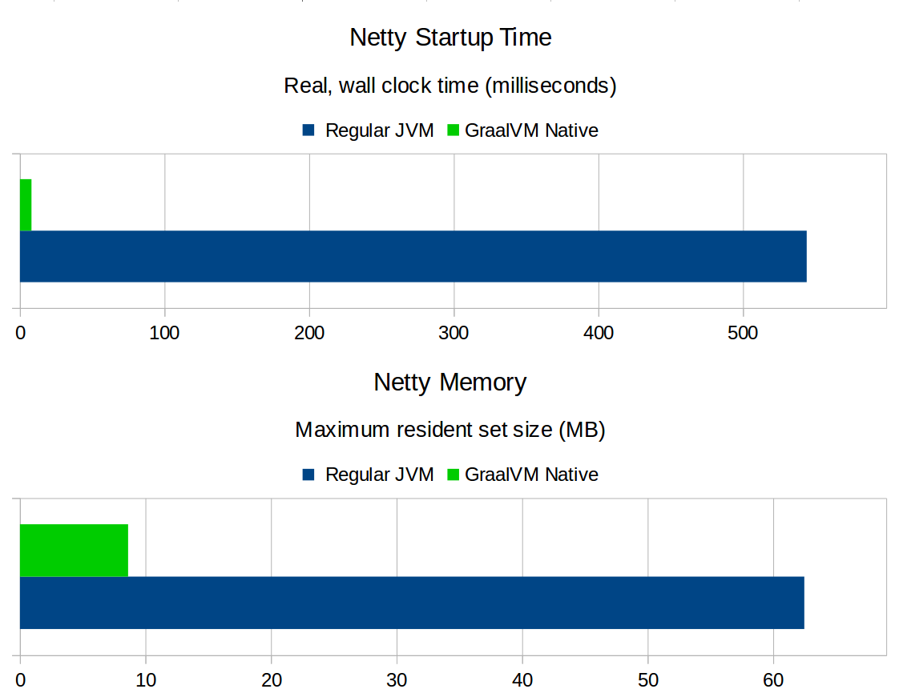

# AmsterdamJS 2018
#### Legalize JavaScript for the Enterprise Now!

<p>&nbsp;</p>
<small>`@pml0pes` - RedHat</small>

---

## Once opon a time...

---

<!-- .slide: data-background="media/windows95.jpg" data-background-size="contain" -->

Notes:
  When computers run Windows95

---

<!-- .slide: data-background="media/Lycos.png" data-background-size="contain" -->

Notes:
  Lycos was **THE** internet search engine

---

<!-- .slide: data-background="media/Google.png" data-background-size="contain" -->

Notes:
  Google was some university project experiment

---

<!-- .slide: data-background="media/TurboCplusplus.png" data-background-size="50%" -->

Notes:
  and IDEs looked like this

---

<!-- .slide: data-background="media/NS6-enableJS.jpg" data-background-size="50%" -->

Notes:
  I've **discovered** JavaScript. At the same time I was learning Java as the main programming language used during my computer science degree.

---

<!-- .slide: data-background="media/windows-server-2008.jpg" data-background-size="50%" -->

Notes:
  Flashforward to 2008...

---

# `¯\_(ツ)_/¯`

* Java is popular on **Fortune 500** companies
  * <!-- .element class="fragment" --> Java **is** Slow
  * <!-- .element class="fragment" --> Java **is** Bloat

Notes:
  **java** was extremelly popular! many fortune 500 companies standardized on it, but you know:

  Java is Slow: well, it was slow! Before the year 2000, the JVM was a interpreter runtime. no Just In Time compiler which would make terrible slow applications.

  Java is Bloat: well, it was bloated. Because the main experience users had was through **cough** Applets. That would require a browser plugin that for the days was a huge download (several megabytes)

---

<!-- .slide: data-background="media/nodejs.jpg" data-background-size="50%" -->

Notes:
  And then on November 8, 2009. Ryan Dahl brought us, nodejs. And it was **crazy**, it was **fast**, it was **productive**, it was simple to the point non developers could quickly learn and get to use it.

---

<!-- .slide: data-background="media/red-forbidden-sign.jpg" data-background-size="50%" -->

* <!-- .element class="fragment" --> Lack of experience
* <!-- .element class="fragment" --> Legacy
* <!-- .element class="fragment" --> Absence of in-house knowledge

Notes:
  What I've observed over my experiences on big corporations, is that due to **bureaucracy**, **legacy** and **old fashioned OPS departments**, enterprises will forbid the use of node, for several reasons such as:

  * Lack of experience (in v8)
  * Legacy systems (that can't be replaced)
  * Absence of in-house knowledge on the platform

  But they will allow Java no matter what.

---

# Reality Check

<small>source: https://www.techempower.com/benchmarks/</small>

Notes:
  Let's make a reality check, techempower runs one of the most popular framework benchmarks. Techempower currently runs 269 different frameworks, code is provided by the community and peer reviewed by the community.

---

<!-- .slide: data-background="media/fast-java-2.jpg" data-background-size="contain" -->

Notes:
  (Zoom top) The latests results shows that: `RUST`, `C`, `Go`, and `Java` are in fact the fastest runtimes currently available.

  (Zoom down) A closer look will list also `Scala` and `Kotlin` are in this ranking. So what does this tell us?

---

# ~~Java~~ JVM is Fast!

Notes:
  This lets us observe that Java is **not** the key to be fast, the JVM is, and the JVM can be fast regardless of the language.

---

# 🤔

Notes:
  Knowing that the **JVM** can be fast, why do many Java apps still have terrible performance?
  
  The reason is that not much as changed since 1998 in the way developers write code. And this lead to the development of modern frameworks such as Vert.x.

---

<!-- .slide: data-background="media/dawg.jpg" data-background-size="contain" -->

Notes:
  Allow me to diverge for a moment here and talk about the Vert.x project (short disclaimer: I am one of the core developers and maintainer of the JavaScript language support).

---

# What is Vert.x?

* <!-- .element class="fragment" --> Reactive (as in Reactive Systems)
* <!-- .element class="fragment" --> Polyglot
* <!-- .element class="fragment" --> Distributed
* <!-- .element class="fragment" --> Framework

Notes:
  Let me introduce what Vert.x, Vert.x is a:
  
  * Reactive (as in Reactive Systems) this means that it allows you to build **elastic** and **resilient** applications
  * Polyglot (runs on the JVM, but does not require Java, **JavaScript** is totally fine)
  * Distributed (as it has builtin P2P cluster support and support a message driven architecture)
  * and finally a Framework (meaning that it's not a full sollution, you are in control on how it works)

---

### Reactor Pattern

<!-- .element class="stretch" --> 

Notes:
  So what's so special about it? It implements the Reactor pattern. This should look familiar right? Node.js right!

---

## Vert.x: like node
#### *but different*

---

### Multi Reactor Pattern

<!-- .element class="stretch" --> 

Notes:
  It uses all your CPU cores (not just one) you will not need to write the cluster code your self. On top of that we make sure that messages across event loops are thread safe and you won't have to deal with locks yourself.

---

### EventBus

<!-- .element class="stretch" --> 

Notes:
  It has a built in event bus, this will allow your applications to scale horizontaly without code changes or even be part of non JVM clusters and the cluster wire protocol is a simple JSON plus TCP socket, which can be used from any platform, OS or language.

---

## Java is: Slow (1/2)

```js
const express = require('express')
const app = express()

app.get('/', (req, res) =>
  res.send(JSON.stringify({msg: 'Hello World!'})))

app.listen(3000, () =>
  console.log('Example app listening on port 3000!'))
```

Notes:
  Consider the following code example. Trivial right.

---

## Java is: Slow (2/2)

```js
vertx
  .createHttpServer()
  .requestHandler(function (req) {
    req.response().end(JSON.stringify({msg: 'Hello World!'}))
  })
  .listen(8080);

console.log('Server listening: http://127.0.0.1:8080/');
```

Notes:
  Now compare it to the Vert.x counter part. Not that different right?

---

<div class="stretch">
     <iframe width="100%" height="100%" src="media/iframe1.html"></iframe>
</div>

Notes:
  The main difference is that Vert.x ranks at #11 while node ranks at #57 and the express implementation at #81.

  If you already run JVMs on production, you can profit from it's performance.

---

## How hard can it be?

Notes:
  How hard can it be to use JavaScript on the JVM? Let's write a simple hello world application.

---

<!-- .slide: data-background-video="media/demo-amsterdamjs-yuv420p.mp4" data-background-size="contain" -->

---

## What can you do today?

* <!-- .element class="fragment" --> Run high performance distributed apps with Vert.x
* <!-- .element class="fragment" --> Run **React SSR** on the JVM
* <!-- .element class="fragment" --> Reuse components from both: **Maven** &amp; **NPM**
* <!-- .element class="fragment" --> Use **TypeScript** or **webpack** if that's your worflow
* <!-- .element class="fragment" --> much more...

<small>Keep an eye on: https://reactiverse.io/es4x/</small>

---

## What can't you do...

<div class="stretch">
     <iframe width="100%" height="100%" src="media/iframe2.html"></iframe>
</div>

Notes:
  I've contributed the JVM specific compat tables to kangax. As you can see, Java8 is very **RED** while Java10 is a bit less... babel/typescript can help to overcome issues...

---

## What about `OPS`?

* <!-- .element class="fragment" --> `vertx-scripts` creates a `pom.xml`
* <!-- .element class="fragment" --> `pom.xml` produces a **runnable jar**
* <!-- .element class="fragment" --> `OPS` can **build from source** using `maven`
* <!-- .element class="fragment" --> `OPS` can deploy from maven **central**/**nexus** 

---

## What's next?

---

<!-- .slide: data-background="media/graalvm.png" data-background-size="contain" -->

Notes:
  GraalVM brings an improved runtime with even better performance that the stock JVM (It also changes the game, by being polyglot first, meaning that it targets many different languages. For JavaScript it currently can run unmodified Node applications that can execute under node 8.9.4.

  This means that in the future, the kangax compatibility table will look more green and you will have the choice to use the fastest deployment runtime with your JavaScript.

  If you use Vert.x, then it's all covered, the library will detect the which VM is onand adapt itself to run as it does on stock JVM or using the improved engine if Graal is available. 

---

<div>
  <!-- .element: class="stretch" --> 
</div>
<small>source: <a href="https:twitter.com/cstancu">@cstancu</a></small>

Notes:
  In some cases 10x less memory, and near 0ms startup times. Meaning that this will be a great options for **Serverless**!!!

---

# Questions?

---

# Thank you!

* https://twitter.com/pml0pes
* https://vertx.io
* https://reactiverse.io/es4x
* http://www.graalvm.org