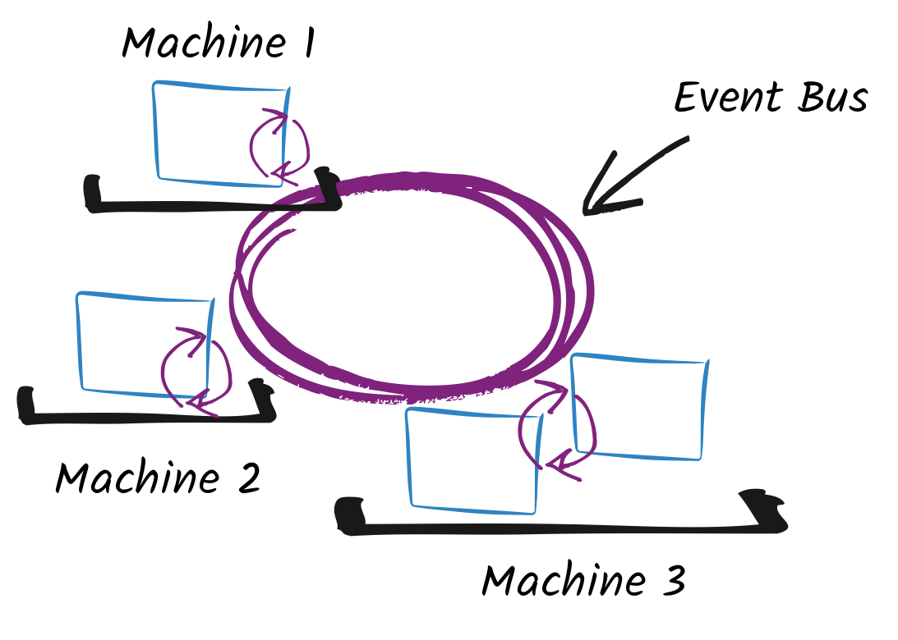

## AmsterdamJS 2018
#### Legalize JavaScript for the Enterprise Now!

Paulo Lopes <small>`@jetdrone`</small>
---

## Who am i

* Principal Software Engineering @ RedHat
* Eclipse Vert.x core developer
* Polyglot: Java, JavaScript, etc...
* ex-GameDev, ex-Architect, OpenSource

---

## Java

* Verbose
* Old
* Slow
* Bloat

Notes:
  Where does your fatigue comes from? Let me guess.
  I've been hearing these statements since 1999! (Yes I'm old). Do they still apply today?

---

## JVM

* 20+ year old project
* Bytecode VM
* J(ust) I(n) T(ime) Compiler
* Bytecode is not Java (or bound to Java)

---

## &lt;Lets-Diverge&gt;

Notes:
  Allow me to diverge for a moment here...

---

### What is Vert.x?

* Framework
* Opinionated
* Reactive (as in Reactive System)
* Polyglot
* Distributed

Notes:
  Reactive means:
  * Responsiveness: on various workloads (elasticity) and in the face of failures (resilience)
  * Message Driven: asynchronous message passing architecture, as the foundation of the previous trait

  Polyglot:
  * Runs on top of the JVM: Java, Kotlin, Ruby, **JavaScript** and others

---

### Reactor Pattern


Notes:
  This should look familiar right? Node.js anyone?

---

## &lt;Improvements&gt;

---

### Multi Reactor Pattern


---

### EventBus



---

### &lt;/Improvements&gt;
### &lt;/Lets-Diverge&gt;

---

## Java is: Slow (1/3)

```js
const express = require('express')
const app = express()

app.get('/', (req, res) =>
  res.send(JSON.stringify({msg: 'Hello World!'})))

app.listen(3000, () =>
  console.log('Example app listening on port 3000!'))
```
<small>https://github.com/pmlopes/presentations/amsterdamjs-2018/slow-node</small>

Notes:
  This is more of a myth than a fact, show techempower

---

## Java is: Slow (2/3)

```js
vertx
  .createHttpServer()
  .requestHandler(function (req) {
    req.response().end(JSON.stringify({msg: 'Hello World!'}))
  })
  .listen(8080);

console.log('Server listening: http://127.0.0.1:8080/');
```
<small>https://github.com/pmlopes/presentations/amsterdamjs-2018/slow-vertx</small>

---

## Java is: Slow (3/3)

demo

---

## Java is: Bloated (1/3)

```js
const WebSocket = require('ws');

for (var i = 0; i < 20 * 1024; i++) {
  const ws = new WebSocket(
      'ws://localhost:8080/eventbus/websocket');

  ws.on('open', function () {
    console.log('Will subscribe to time events');
    ws.send(JSON.stringify(SUBSCRIBE_TIME));
  });
  ws.on('message', function (frame) {
    console.log(JSON.stringify(frame));
  });
}
```
<small>https://github.com/pmlopes/presentations/amsterdamjs-2018/bloat-node</small>

---

## Java is: Bloated (2/3)

```js
var WebSocketFrame = require('vertx-js/web_socket_frame');

for (var i = 0; i < 20 * 1024; i++) {
  vertx.createHttpClient().websocket(8080, "localhost",
      "/eventbus/websocket", function (ws) {

    ws.frameHandler(function (frame) {
      console.log(frame.binaryData());
    });
    console.log('Will subscribe to time events');
    ws.writeFrame(
      WebSocketFrame.textFrame(SUBSCRIBE_TIME, true));
  });
}
```
<small>https://github.com/pmlopes/presentations/amsterdamjs-2018/bloat-vertx</small>

---

## Java is: Bloated (3/3)

demo

---

## Impressive or not?

Notes:
  Now that the myths have been debunked, let me show you how you can profit without needed Java!!!
  Let's make it legal running JavaScript on your JVM enterprise!

---

(big demo creating a full project from vscode)

---

## Futurology

* JavaScript on Java8 sucks!
* JavaScript on Java9/10/11 sucks a bit less!
* JavaScript on GraalVM is awesome!

---

Thanks!
