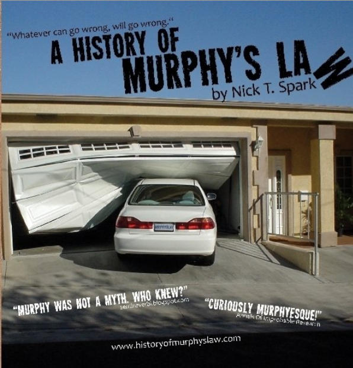

<!-- .slide: style="text-align: left;" -->
## JUDCon:Riviera

### Bringing order to the chaos with Eclipse Vert.x
Paulo Lopes <small>`@pml0pes`</small>
---

<!-- .slide: style="text-align: left;" -->
## Who am I?

* Principal Software Engineer @RedHat
* Eclipse Vert.x core developer
* Polyglot fluent in Java, JavaScript and others
* GameDev, Software Architect, Open Source

Notes:
  Hello everyone and welcome to "bringing order to the chaos" talk. My name is Paulo Lopes and I am a principal
  software engineering at RedHat where I work among others things as a Eclipse Vert.x core developer.

  I consider myself a polyglot and am fluent in many languages, Java, JavaScript and others.

  I've worked on many industries, from gaming to navigation, been software architect to open source contributor.

  But enough about me!

---

## *errare humanum est*

<small>to err is human</small>

Notes:
  The agenda for this talk can be summarized in one very well known Latin expression. **To err is human**.

  Knowing that software is build by humans like you and me, it is guaranteed that there will be bugs.
  We all known the costs of software bugs are incredibly high.

---

* 1987 [Wall Street Crash](http://www.investopedia.com/features/crashes/crashes6.asp) <small class="fragment hl-yellow">$500 billion in one day</small>
* 1993 [Pentium Division Bug](http://www.willamette.edu/~mjaneba/pentprob.html) <small class="fragment hl-yellow"> $475 million</small>
* 1999 [Y2K](http://money.cnn.com/magazines/fortune/fortune_archive/2000/02/07/272831/index.htm) <small class="fragment hl-yellow"> $500 billion</small>
* 2018 [Meltdown Spectre](https://www.wired.com/story/meltdown-spectre-costs-of-unchecked-innovation/) <small class="fragment hl-yellow"> ??? billion</small>
* ...

Notes:
  As a side note, here are a couple of "famous" bugs:

  "Black Monday" (October 19, 1987), the Dow Jones Industrial Average plummeted 508 points, losing 22.6% of its total value. **Cause**:  A long bull market was halted by a rash of SEC investigations of insider trading and by other market forces.  As investors fled stocks in a mass exodus, computer trading programs generated a flood of sell orders, overwhelming the market, crashing systems and leaving investors effectively blind.

  1993 Intel’s highly-promoted Pentium chip occasionally made mistakes when dividing floating-point numbers within a specific range. **Cause**: The divider in the Pentium floating point unit had a flawed division table, missing about five of a thousand entries and resulting in these rounding errors.

  1999 Y2K. **Cause**: To save computer storage space, legacy software often stored the year for dates as two digit numbers, such as “99” for 1999.  The software also interpreted “00” to mean 1900 rather than 2000, so when the year 2000 came along.

  2018 Meltdown, Spectre, costs are not yet known...

---

<!-- .slide: data-background="media/BSoD.jpg" data-background-size="contain" -->

Notes:
  What is clear from these events is that regardless, fail is inevitable! sooner or later it will come!

  You’ll never be able to prevent all possible failure modes, but you can identify many of the weaknesses in your system before they’re triggered by these events.

  The engineers at Netflix coined the term **Chaos Engineering**. My favorite explanation of chaos engineering is from the Forbes magazine:

  *think of a vaccine or a flu shot. While seemingly counterintuitive, you inject yourself with something harmful in order to prevent a future issue. This same technique applies to complex systems on the cloud as well.*

---

*Chaos Engineering <big><span class="fragment">is the discipline of</span> <span class="fragment"><span class="hl-yellow">experimenting</span> on a <span class="hl-yellow">distributed system</span></span> <span class="fragment">in order to <span class="hl-yellow">build confidence</span></span> <span class="fragment">in the system’s capability to <span class="hl-yellow">withstand turbulent conditions</span></span> <span class="fragment">in <span class="hl-yellow">**production**</span>.</span></big>*

Notes:
  The more formal definition is:

  **So what is Chaos Engineering?**

  Chaos Engineering is the discipline of

  experimenting on a distributed system

  in order to build confidence

  in the system’s capability to withstand turbulent conditions

  in production.

---

<!-- .slide: data-background="media/i-test-on-production.jpg" data-background-size="contain" -->

Notes:
  So in a nutshell you can imagine Chaos Engineering sounds like a very dumb idea, but in reality is makes real sense.

---

<!-- .slide: data-background-video="media/dev-staging-prod.mp4" data-background-size="contain" -->

Notes:
  Because "Development" and "Staging" do not always behave as "Production"

---

## Principles of Chaos Engineering

* <!-- .element: class="fragment" --> Build a Hypothesis around <span class="hl-yellow">**Steady State**</span> Behavior
* <!-- .element: class="fragment" --> Vary <span class="hl-yellow">**Real-world**</span> Events
* <!-- .element: class="fragment" --> Run Experiments in <span class="hl-yellow">**Production**</span>
* <!-- .element: class="fragment" --> <span class="hl-yellow">**Automate**</span> Experiments to Run Continuously
* <!-- .element: class="fragment" --> <span class="hl-yellow">**Minimize**</span> Blast Radius

Notes:
  Chaos Engineering revolves around 5 principles

---

## PONG as a Service

> An <span class="underline">highly available</span> AI based Pong application that computes in <span class="underline">realtime</span> the computer move using a webservice that <span class="underline">scales</span> to any number of users!

Notes:
  Let me introduce these principles in a simple example application. Imagine that we want to build a PaaS, **Pong** as a service application.

  This application is made of 2 components. A web client that allows you to run on your browser or mobile, and an AI component that runs
  on the server side and controls all the opponent paddles.

  As you can already observe, this is a very simple client-server application with a mission critical service. The AI service is critical
  not only for the availability of the application but also for performance as updates are frequent and will require lots of network
  requests to be served.

---

<!-- .slide: data-background-video="media/reactive.webm" data-background-size="contain" -->

Notes:
  If I search for the terms "responsive, resilient and elastic" you will find the reactive manifesto. The reactive manifesto will describe the core attributes of a **reactive system**.

---

### Hypothesis

*If **PONG as a Service** is a <span class="hl-yellow">Reactive System</span>,*

<span class="fragment">*it shall be <span class="hl-yellow">responsive</span> delivering a consistent quality of service;*</span>
<span class="fragment">*it will be <span class="hl-yellow">resilient</span> so it stays responsive in the face of failure;*</span>
<span class="fragment">*and it will be <span class="hl-yellow">elastic</span> so the system stays responsive under varying workload.*</span>

---

|                    | Spring5 | node.js | vert.x | Akka |
| ------------------ |:-------:|:-------:|:------:|:----:|
| Responsive         | ✔       | ✔      | ✔     | ✔    |
| Message Driven     |         |         | ✔     | ✔    |
| Resilient          |         |         | ✔     | ✔    |
| Elastic            |         |         | ✔     | ✔    |

<small>[https://www.reactivemanifesto.org/](https://www.reactivemanifesto.org/)</small>

Notes:
  Just to put in context, an out of the box experience of these tools offer the following traits. Given this data and because I am more familiar with Eclipse Vert.x I'll use it during the demo.

---

##### Main.java <small>(1/3)</small>

```java
// Message Handler for AI messages :-)
vertx.eventBus().<JsonObject>localConsumer("paas.ai", msg -> {
  var response = new JsonObject();
  int x_pos = msg.body.ball.x;
  int diff = -(msg.body.paddle.x +
      (msg.body.paddle.width / 2) - x_pos);
  if (diff < 0 && diff < -4) {
    diff = -5;
  } else if (diff > 0 && diff > 4) {
    diff = 5;
  }
  response.put("diff", diff);
  msg.reply(response);
});
```

<small>https://github.com/pmlopes/presentations/tree/rivieradev-2018</small>

Notes:
  To keep the demo simple, here is the simple AI algorithm. You can later read the full source code and experiment yourself by forking the github repo listed here. As you can see the algorithm is quite simple, given the position of the paddle and the ball an impulse is given back with the direction speed difference that should be applied to the paddle.

---

##### Main.java <small>(2/3)</small>

```java
// Create web router for the API calls
Router app = Router.router(vertx);
// Minimal monitoring
app.get("/liveness").handler(rc ->
    rc.response().end("OK"));
app.get("/readiness")
    .handler(HealthCheckHandler.create(vertx));
// Create the event bus bridge and add it to the app.
SockJSHandler ebHandler = SockJSHandler.create(vertx);
app.route("/eventbus/*").handler(ebHandler);
// Serve static resources
app.get().handler(StaticHandler.create());
// Create the HTTP server
vertx.createHttpServer()
    .requestHandler(app::accept).listen(8080);
```

<small>https://github.com/pmlopes/presentations/tree/rivieradev-2018</small>

Notes:
  Then we enter the HTTP component, where we add basic monitoring probes, and create a bridge to the eventbus. Remember reactive systems are message driven,this bridge will allow the application to scale horizontally when deployed as a cluster and will also allow the web browser to participate on the cluster as if it was a member of the cluster. And this concludes the code listing.

  So what is wrong with the previous 2 slides?

---

<!-- .slide: data-background="media/Plan-B.jpg" data-background-size="contain" -->

Notes:
  The title stated 3 code listings and we just saw 2...

  The important message we should take out from chaos, is that, things will fail! So my proposal to you is that always be prepared!

---

##### index.js <small>(3/3)</small>

```js
const EventBus = require('vertx3-eventbus-client');
eventBus.onopen = function () {
  eventBus.registerHandler("paas.ai", (err, msg) => {
    let ball = msg.body.ball;
    let paddle = msg.body.paddle;
    let x_pos = ball.x;
    let diff = -1.0 * (paddle.x + (paddle.width / 2.0) - x_pos);
    if (diff < 0 && diff < -4) {
      diff = -5;
    } else if (diff > 0 && diff > 4) {
      diff = 5;
    }
    msg.reply({diff: diff});
  });
};
```

<small>https://github.com/pmlopes/presentations/tree/rivieradev-2018</small>

Notes:
  My plan B is to have the mission critical service being able to run on a different location and in my case even using a different runtime. Of course this is not always possible but remember that being able to be polyglot can help you in case your runtime A is affected my a security bug, switching to another runtime can keep your business running while giving you the leverage to fix the issues without down time.

---

### Real World Events

* Software bug
* DDoS
* Network outages
* Server Crashes
* ...

Notes:
  So in this demo let's consider the following real world events. Remember the examples I've described in the beginning of the presentation,
  A software bug like the Y2K bug, a DDoS like the crash of the Wall Street, a network outage induced by hardware problems like the Pentium
  bug, or plain simple server crashes by hardware bugs, overheating, etc...

  So we need to run these experiments in production...

---

#### Production

```sh
# start an OpenShift instance
oc cluster up
# deploy the application
mvn clean fabric8:deploy
```

<a href="https://127.0.0.1:8443/console" target="_blank">OpenShift Console</a>

Notes:
  OpenShift Origin is a distribution of Kubernetes optimized for continuous application development and multi-tenant deployment. OpenShift adds developer and operations-centric tools on top of Kubernetes to enable rapid application development, easy deployment and scaling, and long-term lifecycle maintenance for small and large teams.

  I can now deploy my application using standard build tools, as the application is build using Vert.x and Vert.x runs on the JVM I'll be using Apache Maven, but you could use your favourite tool.

---

#### Tooling

* https://github.com/netflix/chaosmonkey
* <!-- .element: class="fragment grow" --> https://github.com/alexei-led/pumba
* <!-- .element: class="fragment" --> https://github.com/wg/wrk
* <!-- .element: class="fragment" --> https://git.kernel.org/pub/scm/network/iproute2/iproute2.git

Notes:
  Our application is running so we need to start doing experiments, there are 2 popular tools: **chaos monkey** from netflix and **pumba**. Chaos Monkey although more complex is from netflix and made to solve netflix issues, and my demo is clearly not netflix. Chaos monkey assumes you deploy to AWS and have instances across the world. **Pumba** on the other hand... is the small brother that performs many tests but assumes that your application is running as **Docker Containers**. Since OpenShift/Kubernetes runs my application as a **container** this tool is perfect for smaller businesses than netflix, like myself.

---

### Testing Real World Events

* <span class="hl-yellow">DDoS</span>
* Network outages
* Server Crashes

```sh
wrk -t4 -c400 -d60s http://paas-myproject.127.0.0.1.nip.io/
```

Notes:
  The simplest way to test for DDoS is to run... a load testing tool and you can mitigate
  the issue by using the scaling features of the reactive system/deployment platform.

---

### Testing Real World Events

* DDoS <span class="hl-yellow">✔</span>
* <span class="hl-yellow">Network outages</span>
* Server Crashes

```sh
# Introduce packet loss
pumba --debug netem --duration 1m \
  --tc-image gaiadocker/iproute2 \
  loss -p 20 -c 10 "re2:.*chaos.*"
```

Notes:

---

### Testing Real World Events

* DDoS <span class="hl-yellow">✔</span>
* <span class="hl-yellow">Network outages</span>
* Server Crashes

```sh
# Introduce latency
pumba --debug netem --duration 1m \
  --tc-image gaiadocker/iproute2 \
  delay --time 500 "re2:.*chaos.*"
```

Notes:

---

### Testing Real World Events

* DDoS <span class="hl-yellow">✔</span>
* <span class="hl-yellow">Network outages</span>
* Server Crashes

```sh
# Introduce latency (2)
pumba --debug netem --duration 1m \
  --tc-image gaiadocker/iproute2 delay \
  --time 100 \
  --jitter 30 \
  --correlation 20 \
  "re2:.*chaos.*"
```

Notes:

---

### Testing Real World Events

* DDoS <span class="hl-yellow">✔</span>
* Network outages <span class="hl-yellow">✔</span>
* <span class="hl-yellow">Server Crashes</span>

```sh
pumba --random --interval 1m \
      kill --signal SIGKILL "re2:.*chaos.*"
```

Notes:

---

### Testing Real World Events

* DDoS <span class="hl-yellow">✔</span>
* Network outages <span class="hl-yellow">✔</span>
* Server Crashes <span class="hl-yellow">✔</span>

Notes:
  So at this moment we've covered the basic tests, now its up to you to add your own experiments.

---

### Automate Experiments to Run Continuously

<!-- .element: class="stretch" --> 

Notes:

---

### Minimize Blast Radius

<!-- .element: class="stretch" --> 

Notes:
  Remember, no matter what you do, murphy law will still apply: "Anything that can go wrong will go wrong"

---

### Minimize Blast Radius (Tips)

* <!-- .element: class="fragment grow" --> Have a fallback plan when things go wrong
* <!-- .element: class="fragment grow" --> Avoid Monoliths
* <!-- .element: class="fragment grow" --> Deploy across regions/multiple platforms
* <!-- .element: class="fragment grow" --> Use Circuit Breaker patterns
* <!-- .element: class="fragment grow" --> Read the [awesome-chaos-engineering](https://github.com/dastergon/awesome-chaos-engineering)
* <!-- .element: class="fragment grow" --> Be creative!

---

<!-- .slide: style="text-align: left;" -->
# Thank you!

* https://www.jetdrone.xyz
* https://twitter.com/pml0pes
* https://github.com/vert-x3
* https://www.reactivemanifesto.org
* http://principlesofchaos.org
* https://github.com/dastergon/awesome-chaos-engineering
