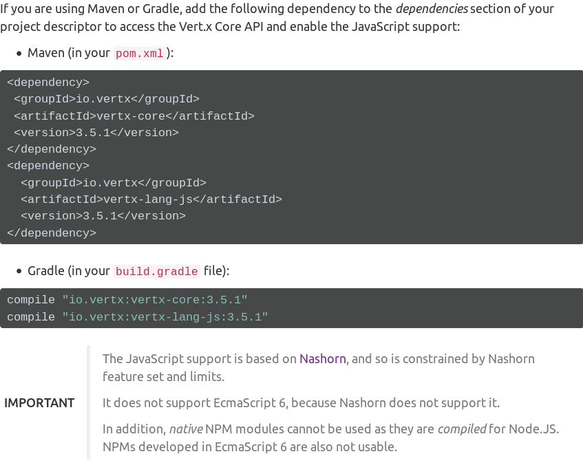
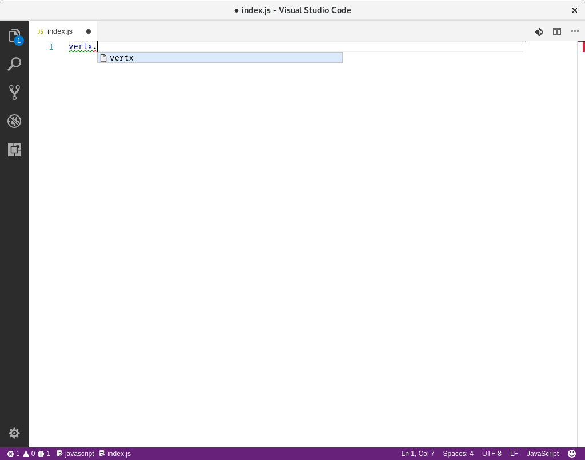
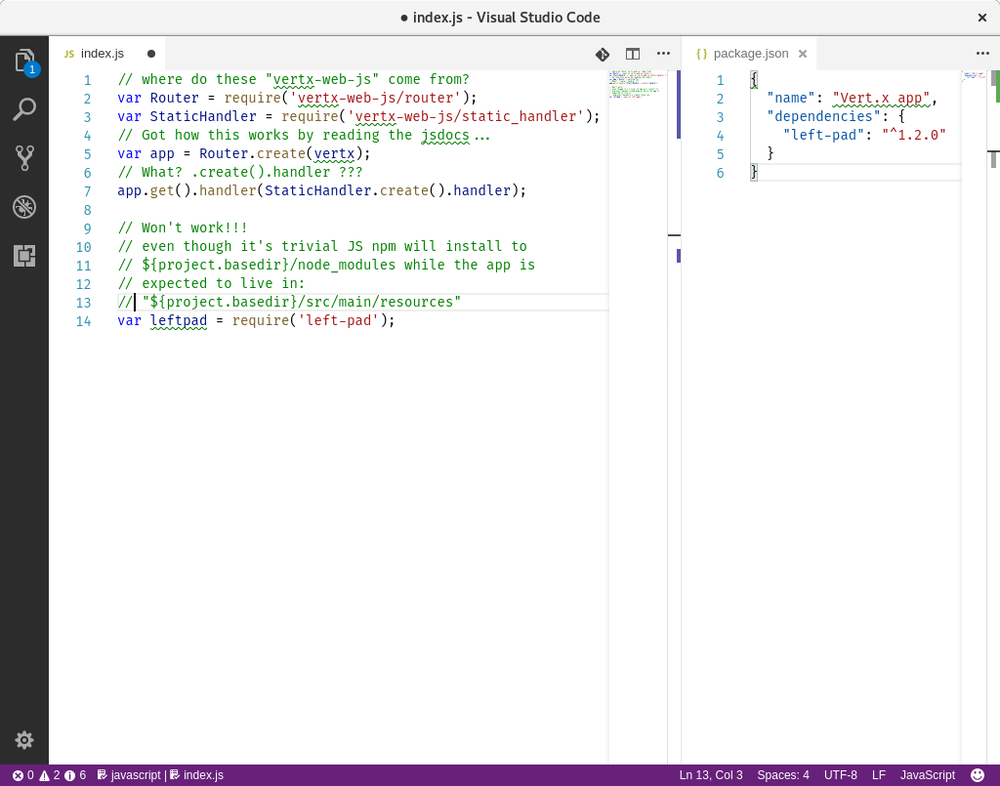

# F2F

### Vert.x 4 Fullstack Developers

<small>by [Paulo Lopes](https://www.jetdrone.xyz) / [@jetdrone](http://twitter.com/jetdrone)</small>

---

> JavaScript is like Vodka: you're Okay if you just drink it, but when you say you like it, you should realize there's something wrong with you

---

<!-- .slide: style="text-align: left;" -->
## Agenda

1. Current state of affairs           <!-- .element: class="fragment grow" -->
2. Making JS Great again              <!-- .element: class="fragment grow" -->
3. Appealing to Frontend Developers   <!-- .element: class="fragment grow" -->

---

### Can you bootstrap a JS project?

---

<!-- .element: class="stretch" --> 

<aside class="notes">
  Manual refers to maven and gradle, not common for JS devs, so you go to stackoverflow and get a pom file.
</aside>

---

### Can you code JS?

---

<!-- .element: class="stretch" --> 

<aside class="notes">
  No editor support... and then you go to the jsdocs... (maybe)
</aside>

---

<!-- .element: class="stretch" --> 

<aside class="notes">
  And it then gets magical...
</aside>

---

<!-- .element: class="stretch" --> 

<aside class="notes">
  But not really...
</aside>

---

## Making JS Great again

* Use JS tooling + conventions (NPM/Yarn)   <!-- .element: class="fragment grow" -->
* Proper Editor support                     <!-- .element: class="fragment grow" -->
* Easily test                               <!-- .element: class="fragment grow" -->

---

### Use JS Tooling

<aside class="notes">
  Lets face it, we can delegate as much as we can on npm but we will still need
  to interact with a java build tool, since I was more comfortable with maven,
  maven it was.

  To make thinks simpler I've creates a bunch of scripts that will help with the
  common tasks
</aside>

---

### Proper IDE support

* New CommonJS loader (fixed jvm-npm issues)    <!-- .element: class="fragment grow" -->
* New Verticle factory (relies on new loader)   <!-- .element: class="fragment grow" -->
* New Global objects (Console, Promise, JSON)   <!-- .element: class="fragment grow" -->
* Type information (typescript.d files)         <!-- .element: class="fragment grow" -->

---

### Why .d files?

* Jetbrains, VSCode, etc uses it...
* It gives type hinting for TypeScript and JavaScript
* It's used only at development time
* No performance impact
* Easy to generate

---

<!-- .slide: data-background="images/fun.gif" -->

---

## DEMO
